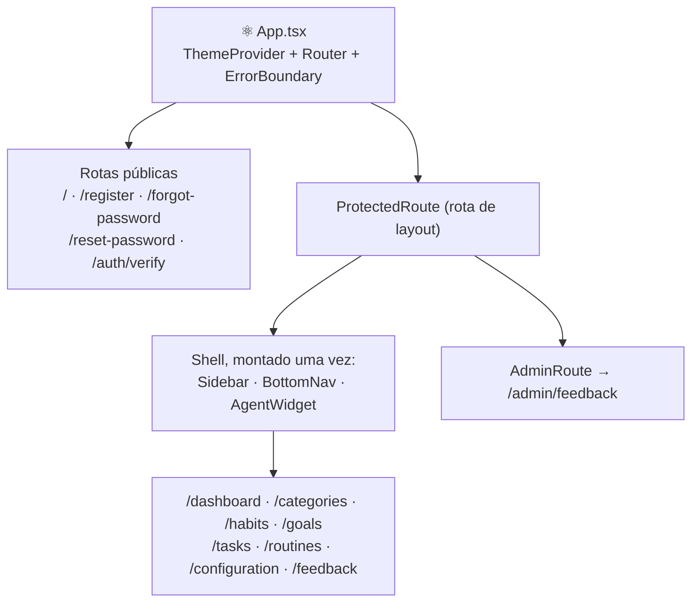

Este documento mapeia o frontend web: como páginas e componentes se organizam, os padrões que toda feature segue, como os widgets do dashboard e o tutorial funcionam e como o bundle é dividido. O web app vive em `apps/web` do monorepo e consome os pacotes compartilhados (state, theme, i18n, validation, icons, api) como código-fonte através de aliases do Vite.

## Rotas e o shell


```mermaid
flowchart TD
  APP["⚛️ App.tsx<br/>ThemeProvider + Router + ErrorBoundary"]
  APP --> PUB["Rotas públicas<br/>/ · /register · /forgot-password<br/>/reset-password · /auth/verify"]
  APP --> PROT["ProtectedRoute (rota de layout)"]
  PROT --> SHELL["Shell, montado uma vez:<br/>Sidebar · BottomNav · AgentWidget"]
  SHELL --> PAGES["/dashboard · /categories · /habits · /goals<br/>/tasks · /routines · /configuration · /feedback"]
  PROT --> ADMIN["AdminRoute → /admin/feedback"]
```

Todo componente de rota é lazy, incluindo o próprio AdminRoute, então usuários comuns nunca baixam o portão de admin nem suas chamadas de API. Um único Suspense com spinner de tela cheia envolve a tabela de rotas. No boot, o `useSilentRefresh` segura o app em um estado de "checando" até o cookie de refresh ser trocado por um token, e é isso que evita um flash de 401s ou um pulo para o login no reload.

O shell monta uma vez dentro da rota de layout protegida: a Sidebar colapsável do desktop (ordem: Hoje, Categorias, Hábitos, Tarefas, Rotinas, Metas, com Feedback e Config no rodapé), o BottomNav do celular (Hoje, Rotinas, o Assistente no slot central como única entrada do agente, Hábitos e uma folha de Mais) e o AgentWidget flutuante. Páginas não renderizam header próprio; um PageHeader compartilhado é o bloco de título. Itens de navegação carregam âncoras `data-tutorial-id` para o spotlight do tutorial.

As páginas de autenticação evitam o registro de ícones de propósito, mantendo os chunks de ícones e emojis fora do primeiro carregamento sem login.

## Organização de componentes

```
src/
  pages/        uma pasta por rota, testes ao lado
  components/   pastas por domínio (agent, categories, dashboard, goals,
                habits, routines, tasks, tutorial, widgets, ...)
  ui/           primitivos do design system, sem conhecimento de domínio
  hooks/  context/  lib/  services/  redux/  utils/
```

A camada `ui/` guarda os primitivos: Card, Chip, Ring, XpBar, XpSparkline, StatTile, SegmentedControl, IconButton, IconTile, CheckStrip, GhostAdd, BeyouIcon, PageHeader. Componentes de domínio compõem esses. O Modal compartilhado é um portal com focus trap de verdade: ciclo de Tab, restauração de foco ao fechar, Escape e aria-labelledby, e todo diálogo do app renderiza por ele.

### O quarteto por entidade

Toda entidade de domínio (categoria, hábito, tarefa, meta, rotina) segue o mesmo padrão de quatro partes:

| Parte | Papel |
|-------|-------|
| createX / editX | Invólucros finos de modal que escolhem o modo do formulário |
| XForm | O formulário react-hook-form compartilhado, um por entidade |
| xBox | O card expansível de um item, com ações de editar e apagar |
| renderXs | A grade responsiva que mapeia a lista |

Os formulários validam por schemas zod que vivem no pacote compartilhado de validação, escritos como fábricas que recebem a função de tradução, então toda mensagem de validação é bilíngue por construção. As regras de rotina entre campos (seções com horários sobrepostos, faixas atravessando a meia-noite) moram ao lado como funções puras que o formulário e o builder de rotina chamam.

## Dashboard e widgets

O dashboard compõe um card de perfil, atalhos, a rotina de hoje com seu fluxo de check-in, um trilho de metas e a área configurável de widgets.

A identidade dos widgets é estado compartilhado: a lista de ids vive no pacote de state (worstArea, constance, constanceHeatmap, betterArea, dailyProgress, fastTips, levelProgress, categoryBalance), e os dois apps a leem. Quatro renderizam em largura cheia. Um componente fábrica mapeia id para componente, então adicionar um widget é uma entrada no mapa mais uma na lista compartilhada.

A seleção mora na Configuração: uma lista com arrastar-para-reordenar que salva sozinha a cada mudança, empurrando a nova ordem para o backend e o Redux juntos, e sem gravar nada no Redux quando o servidor recusa. No celular, o dashboard renderiza os widgets em um carrossel de snap-scroll, um por tela, para widgets novos nunca empurrarem a rotina de hoje para baixo da dobra.

## O tutorial, em dois sistemas

O onboarding é uma máquina de fases persistida em localStorage, com valores validados por whitelist na leitura:

```
intro → ai-onboarding → dashboard → categories → habits-dashboard → habits
→ routines-dashboard → routines → routines-summary → config-dashboard → config → done
```

Dois sistemas distintos andam sobre essa máquina:

- **O modal de introdução**: quatro cards de conceito (categorias, hábitos, tarefas, rotinas) e depois uma bifurcação: seguir o assistente de onboarding com IA ou o tour manual.
- **O tour de spotlight**: cada passo nomeia um seletor CSS, uma posição e uma ação (clicar ou observar). O localizador pega o primeiro alvo visível, o que permite que a sidebar do desktop e a folha de Mais do celular dividam as mesmas definições de passos, e o tooltip se prende à viewport. Cada página tem um hook dono dos seus passos e transições de fase.

O assistente de IA percorre cinco passos (categorias, hábitos e tarefas, rotina, metas, resumo), buscando sugestões tipadas do backend e criando entidades reais passo a passo pelos endpoints REST comuns. O progresso persiste em localStorage só como passo-mais-referências-criadas; as sugestões em si deliberadamente não persistem, então um reload rebusca em vez de criar em dobro. As criações consultam a conta antes e pulam um nome que já esteja lá, o que evita que o Tentar novamente do banner de erro some uma segunda cópia de tudo o que a tentativa falha já tinha conseguido criar. Uma falha agora diz de que tipo é: uma chamada de sugestão que falhou mantém a tela de IA indisponível, enquanto uma escrita de entidade recusada nomeia o que quebrou, mostra o motivo do servidor e lista o que o assistente já salvou.

## Feedback de gamificação

Três peças transformam um check de rotina em progresso visível:

- **XpFloat**: um chip de "+N XP" que sobe sobre o item marcado por um segundo, guiado pelo xpGenerated real da resposta do check. Com movimento reduzido, ele só esmaece no lugar.
- **CelebrationOverlay**: um overlay global drenando uma fila FIFO de celebrações (level-ups e marcos de streak), fechando sozinho em quatro segundos, dispensável por clique ou Escape.
- **O fluxo RefreshUI**: respostas de check carregam um payload RefreshUI, e uma função compartilhada de aplicação atualiza os slices de perfil, categorias, hábito e rotina em uma passada, decidindo no caminho se uma celebração entra na fila. Os detalhes vivem no [tópico de Redux e dados](/architecture/redux-data).

A frescura dos dados fica com uma política compartilhada de auto-refresh com três gatilhos: voltar para a aba, o dia local virar e um intervalo de cinco minutos enquanto visível. Voo único, silenciosa em falha e totalmente pausada com a aba escondida ou uma animação de check no meio.

## Code splitting

Laziness por rota mais cinco chunks manuais, em uma ordem que importa:

| Chunk | Conteúdo | Por quê |
|-------|----------|---------|
| icons-base | react-icons | O peso opcional mais pesado |
| telemetry | SDK do Sentry | Precisa casar antes da regra de forms: o SDK traz um arquivo com "zod" no caminho. Some por completo em builds sem DSN |
| motion | framer-motion | Só necessário depois do login |
| forms | react-hook-form, resolvers, zod | Só páginas cheias de formulário |
| vendor | react, router, família redux | A base estável |

O servidor de dev pré-empacota as dependências das rotas lazy, porque descobri-las no meio da sessão disparava uma re-otimização e um reload completo com o app em uso.

## Convenções que valem manter

- Todo elemento interativo é um botão ou link de verdade, tiles de ícone incluídos. Os tiles do seletor de ícones eram os últimos `<span onClick>` e hoje são botões com aria-label.
- Toasts têm teto de três, posição por classe de dispositivo, com componentes próprios de fechar e ícone.
- Convites de uma vez só (como o aceno de widgets vazios) são dispensados por um hook compartilhado de flag em localStorage, sem estado improvisado.
- Arrastar e soltar usa react-beautiful-dnd atrás de um shim para o StrictMode.
