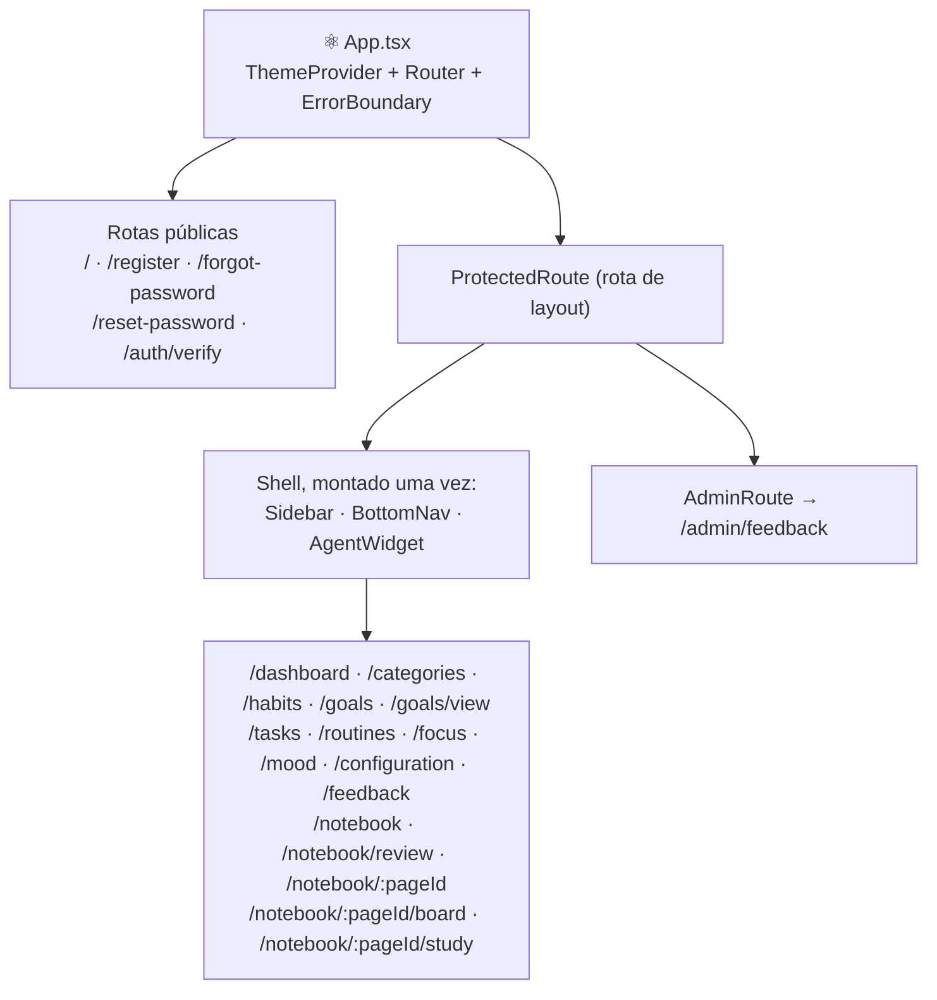

Este documento mapeia o frontend web: como páginas e componentes se organizam, os padrões que toda feature segue, como os widgets do dashboard e o tutorial funcionam e como o bundle é dividido. O web app vive em `apps/web` do monorepo e consome os pacotes compartilhados (state, theme, i18n, validation, icons, api) como código-fonte através de aliases do Vite.

## Rotas e o shell


```mermaid
flowchart TD
  APP["⚛️ App.tsx<br/>ThemeProvider + Router + ErrorBoundary"]
  APP --> PUB["Rotas públicas<br/>/ · /register · /forgot-password<br/>/reset-password · /auth/verify"]
  APP --> PROT["ProtectedRoute (rota de layout)"]
  PROT --> SHELL["Shell, montado uma vez:<br/>Sidebar · BottomNav · AgentWidget"]
  SHELL --> PAGES["/dashboard · /categories · /habits · /goals · /goals/view<br/>/tasks · /routines · /focus · /mood · /configuration · /feedback<br/>/notebook · /notebook/review · /notebook/:pageId<br/>/notebook/:pageId/board · /notebook/:pageId/study"]
  PROT --> ADMIN["AdminRoute → /admin/feedback"]
```

Todo componente de rota é lazy, incluindo o próprio AdminRoute, então usuários comuns nunca baixam o portão de admin nem suas chamadas de API. Dois Suspense apanham esses chunks, e onde cada um fica importa. O do `App.tsx`, com spinner de tela cheia, serve as rotas públicas. O de dentro do `ProtectedRoute`, com um spinner do tamanho da página, envolve só o outlet, então uma página carregando pela primeira vez pode apagar a área da página e nada mais. Durante um tempo só existia o de fora, e a primeira visita a qualquer página escondia o shell inteiro enquanto o chunk descia. O React desmonta os layout effects quando um Suspense esconde conteúdo, e o framer-motion guarda o estado da animação num deles, então um painel do assistente fechado nesse mesmo tick (que é o que os links internos do agente fazem) perdia a animação de saída e voltava com opacidade total com o widget já achando que tinha fechado. A bolha desenhava por cima do chat e o Escape não fazia nada. No boot, o `useSilentRefresh` segura o app em um estado de "checando" até o cookie de refresh ser trocado por um token, e é isso que evita um flash de 401s ou um pulo para o login no reload.

O shell monta uma vez dentro da rota de layout protegida: a Sidebar colapsável do desktop (ordem: Dashboard, Categorias, Hábitos, Tarefas, Rotinas, Metas, Caderno, Diário, com Feedback e Config no rodapé), o BottomNav do celular (Dashboard, Rotinas, o Assistente no slot central como única entrada do agente, Hábitos e uma folha de Mais com o resto, o Caderno incluído) e o AgentWidget flutuante. Páginas não renderizam header próprio; um PageHeader compartilhado é o bloco de título. Itens de navegação carregam âncoras `data-tutorial-id` para o spotlight do tutorial.

As páginas de autenticação evitam o registro de ícones de propósito, mantendo os chunks de ícones e emojis fora do primeiro carregamento sem login.

## Organização de componentes

```
src/
  pages/        uma pasta por rota, testes ao lado
  components/   pastas por domínio (agent, categories, dashboard, goals,
                habits, routines, tasks, tutorial, widgets, ...)
  ui/           primitivos do design system, sem conhecimento de domínio
  hooks/  context/  lib/  services/  redux/  utils/
```

A camada `ui/` guarda os primitivos: Card, Chip, Ring, XpBar, XpSparkline, StatTile, SegmentedControl, IconButton, IconTile, CheckStrip, GhostAdd, BeyouIcon, PageHeader. Componentes de domínio compõem esses. O Modal compartilhado é um portal com focus trap de verdade: ciclo de Tab, restauração de foco ao fechar, Escape e aria-labelledby, e todo diálogo do app renderiza por ele.

### O quarteto por entidade

Toda entidade de domínio (categoria, hábito, tarefa, meta, rotina) segue o mesmo padrão de quatro partes:

| Parte | Papel |
|-------|-------|
| createX / editX | Invólucros finos de modal que escolhem o modo do formulário |
| XForm | O formulário react-hook-form compartilhado, um por entidade |
| xBox | O card expansível de um item, com ações de editar e apagar |
| renderXs | A grade responsiva que mapeia a lista |

Os formulários validam por schemas zod que vivem no pacote compartilhado de validação, escritos como fábricas que recebem a função de tradução, então toda mensagem de validação é bilíngue por construção. Todo rótulo passa por um único `FormLabel` (`FieldLabel` no mobile) que desenha a situação do campo: um asterisco na cor de destaque onde o servidor recusa o formulário sem ele, um "opcional" discreto onde pode ficar vazio, um marcador por campo e nunca os dois. As flags seguem os DTOs de requisição, não o gosto; a importância e a dificuldade de uma tarefa foram o caso que criou a regra, já que os dois clientes as exigiram por meses enquanto o servidor nunca exigiu. As regras de rotina entre campos (seções com horários sobrepostos, faixas atravessando a meia-noite) moram ao lado como funções puras que o formulário e o builder de rotina chamam. Uma rotina em lista valida por um schema próprio, não por um desvio dentro do da diária: os dois formulários guardam estados de fato diferentes, um array de seções com horário contra um array plano de hábitos e tarefas escolhidos, e um schema que aceitasse os dois não checaria nenhum direito.

## Dashboard e widgets

O dashboard compõe um card de perfil, atalhos, a rotina de hoje com seu fluxo de check-in, um trilho de metas e a área configurável de widgets.

## O diálogo de novo dia

A primeira abertura do painel num dia pode levantar o Resumo do Dia: um `Modal` partilhado na web, um `BottomSheet` no telemóvel, duas colunas a partir de `lg` e empilhadas abaixo disso, com a metade acionável à frente nos dois eixos.

A metade esquerda é a única parte em que se pode agir: os itens de ontem que não estão marcados nem pulados, cada um com o check e o skip que os endpoints de snapshot já oferecem. Pular fica fora dessa lista porque é uma resposta que o usuário já deu; aparece antes na linha de resumo. Dois estados vazios diferentes partilham o espaço e não podem ser juntos num só, porque um dia que o usuário fechou e um dia em que nada estava marcado não são o mesmo resultado e só o primeiro merece o destaque. Dias mais antigos ainda recuperáveis ficam atrás de uma dobra, já que o painel é sobre ontem e sete dias de atraso todas as manhãs é como se ensina alguém a fechar um diálogo sem o ler.

A metade direita são duas páginas atrás de um paginador: o que hoje traz, depois como correu ontem. **Nada a mexe sozinha, e um temporizador aqui seria pior do que na maioria dos painéis.** O texto chega de um LLM quando chega, portanto quem acabou de começar a página é quem tem mais probabilidade de ser tirado dela. O paginador é por isso a única coisa que muda a página, e são dois separadores com nome e não bolinhas: o usuário precisa de saber que pode ir a outro lado, não só onde está, e duas palavras dizem-no onde duas circunferências não dizem.

A lista de dias anteriores é agrupada por dia, com a data como cabeçalho e o dia a expirar assinalado. Uma linha ali traz o nome da secção e quanto vale marcá-la agora, e nenhum dos dois responde à pergunta para a qual o painel existe. "Fiz isto?" é uma pergunta sobre um DIA: as pessoas lembram-se da segunda-feira passada, não de um hábito solto de uma. Agrupado em vez de carimbar a data em todas, porque uma semana de rotina cheia são dezenas de itens e as mesmas seis datas repetidas pela lista abaixo são ruído a ler por cima em vez de estrutura a percorrer. A lista do próprio ontem não precisa de nada disso, já que todas as linhas dela são de ontem e o cabeçalho já o diz.

Fechar é um clique, e um clique perto da borda de um modal é fácil de dar antes de o ter lido. Por isso o ecrã de configuração traz um botão "Ver o resumo de hoje", que leva o usuário ao painel com o diálogo aberto à força. Esse pedido ganha ao "já foi visto" e ao "fechado nesta sessão", porque esses existem para impedir que o diálogo apareça sem ser pedido e isto é o contrário. Não ganha ao "não há nada para dizer": a resposta a pedir um resumo vazio é o painel, não um modal vazio. Reabrir deixa de propósito o `seenAt` do servidor em paz. O dia FOI reconhecido, e limpar a coluna reabriria o diálogo nos outros aparelhos da pessoa, o que ninguém pediu.

Se o diálogo abre sequer é decidido no `@beyou/state`, não em cada app. Fica fechado quando o servidor diz que o dia já foi reconhecido, quando não há nada que valha a pena dizer, enquanto qualquer fase do tutorial é dona do ecrã, e depois de o usuário o ter fechado nesta sessão. Também só é montado enquanto deve estar visível, para que um formato de resposta que ninguém esperava não possa chegar a um render no ecrã inicial da app.

## Metas: a árvore e a vitrine

A página de metas agrupa as submetas debaixo da meta principal por defeito, com a lista plana a um toque de distância. Um card com submetas traz um chip "n/m submetas", uma segunda barra fina com a média do progresso das filhas e uma dobra que as lista como linhas compactas com o seu próprio stepper, cujo contador abre o mesmo diálogo de quantidade da meta principal (somar ou tirar qualquer valor, não só um); quando todas as filhas estão concluídas o card oferece completar o pai, porque isso continua a ser a única coisa que paga o XP dele. A pesquisa e o deep link olham através da hierarquia: um acerto numa submeta mantém a meta principal na página, esbatida quando só passou por causa da filha. O seletor "Meta principal" do formulário é pré-filtrado com a mesma regra que o servidor impõe (não ela própria, não uma descendente, três níveis), e "Adicionar submeta" num card abre-o já com o pai, as categorias e o prazo dele preenchidos. Apagar um pai avisa que as filhas passam a metas principais. Arquivar é a saída mais suave: a ação Arquivar de um card guarda a meta com as submetas, um aviso diz quantas foram junto, e o filtro de status ganha a visão Arquivadas (com a contagem), onde cada card mostra o progresso congelado e um botão Restaurar no lugar do stepper. O visualizador, a linha do tempo do dashboard e os seletores de pai só enxergam metas ativas.

`/goals/view` é a mesma meta, uma de cada vez: uma camada `fixed inset-0` por cima do shell, como o Modo Foco, com Escape como saída. Cada slide dá à motivação o espaço que o card nunca teve, um anel de progresso grande, o prazo em dias restantes, as categorias, o mesmo stepper e botão Completar do card, e as submetas como uma lista. O baralho tem duas disposições, escolhidas ao lado da ordenação e guardadas por dispositivo em `viewFilters.goalsViewerLayout`. Agrupada, a predefinida, percorre só as metas principais: uma submeta nunca é um slide próprio, tocar nela abre-a inteira por cima do slide da meta pai (com o seu anel, stepper, Completar e submetas), e um controlo de voltar, ou o back do browser, devolve à meta pai; o contador de posição continua a contar metas principais. Lista é a disposição antiga, cada meta como slide próprio, submetas incluídas. A ordenação é por status por defeito (em progresso, depois não iniciadas, depois concluídas), ou por categoria, prazo, progresso ou nome, guardada por dispositivo em `viewFilters.goalsViewer`; as setas e o teclado percorrem o mesmo baralho, e `?goal=` abre num slide dado, ou no slide da meta pai com a submeta aberta quando o baralho está agrupado. A app mobile tem o mesmo ecrã na raiz do router, fora do grupo de abas, pela mesma razão que o ecrã de foco vive lá: a barra inferior é irmã dos ecrãs, não uma sobreposição, e um ecrã dentro do grupo não a consegue esconder.

Os ecrãs do Modo Foco (`/focus`, e a rota `focus` na raiz do router no mobile) seguem duas regras que o dashboard já guarda. Um check paga à vista: o passo do Ultra Foco mostra o XP que a conclusão rendeu, lido da própria resposta do check e não da store, porque o slice de rotina não traz um `xpGenerated` novo para um item desmarcado e marcado outra vez, e nunca actualiza os itens de uma rotina em lista. Pulado tem o seu próprio aspecto: o botão Concluir de um item pulado perde a cor de destaque, e um olhar distingue pulado de pendente. O fim do pomodoro é anunciado, nas duas plataformas, pelos dois interruptores guardados nos ajustes do foco: um apito curto sintetizado (web) ou o som da própria notificação (mobile), e uma notificação do sistema cuja permissão é pedida no primeiro arranque de um ciclo, nunca no boot, e cuja recusa só deixa o timer mais silencioso. Na web o apito é armado no relógio de parede no momento em que o ciclo arranca, porque uma aba em segundo plano reduz o tick a cerca de uma vez por minuto, e o contexto de áudio é criado dentro do clique de arrancar para a política de autoplay do browser deixar o primeiro ciclo soar.

A identidade dos widgets é estado compartilhado: a lista de ids vive no pacote de state (worstArea, constance, constanceHeatmap, betterArea, dailyProgress, fastTips, levelProgress, categoryBalance, moodWeek), e os dois apps a leem. Quatro renderizam em largura cheia. Um componente fábrica mapeia id para componente, então adicionar um widget é uma entrada no mapa mais uma na lista compartilhada. O mapa do mobile é um `Record<WidgetId, …>` exaustivo, então um id novo quebra o build do mobile até o mobile o implementar. Isso é de propósito: a alternativa é um widget sobre o qual as duas plataformas discordam.

A maioria dos widgets recebe os dados do dashboard. Dois buscam os próprios, o heatmap de constância e a semana de humor, porque ambos leem um intervalo de datas que mais nada na página precisa, e ambos são opcionais, então quem não os usa não deve pagar o pedido. Um widget que busca sozinho deve à coluna uma altura estável enquanto carrega: o `moodWeek` desenha a forma da semana com círculos de espera e um atributo `data-loading` em vez de escolher entre as suas duas vistas, porque escolher cedo pintava uma semana inteira de dias vazios e depois saltava, duas vezes, para quem ainda não tinha marcado o dia. Os seus dois estados são as cinco carinhas quando o dia ainda não está marcado e, depois de estar, sete dias desenhados com a carinha de cada um. São os mesmos ícones da escala e da grelha do mês, para os três sítios onde um humor aparece o dizerem da mesma maneira. Um dia que ninguém registou não tem carinha, por isso mantém um círculo apagado, que é também o que segura a altura da linha numa semana com falhas.

A seleção mora na Configuração: uma lista com arrastar-para-reordenar que salva sozinha a cada mudança, empurrando a nova ordem para o backend e o Redux juntos, e sem gravar nada no Redux quando o servidor recusa. No celular, o dashboard renderiza os widgets em um carrossel de snap-scroll, um por tela, para widgets novos nunca empurrarem a rotina de hoje para baixo da dobra.

## O diário

A `/mood` é uma página comum dentro do shell, e a única cujo conteúdo é algo que a pessoa
escreveu em vez de algo que o app registou. Quatro blocos de cima para baixo: o dia com as suas
cinco carinhas, a caixa do diário com um botão Salvar, um calendário do mês com uma carinha por
dia registado, e os registos recentes.

A partir do `lg` são duas colunas: o dia e o seu mês à esquerda, o texto e o que foi escrito à
direita. O diário fecha, porque quem está a comparar um mês de carinhas não quer nove linhas de
caixa de texto entre ele e o calendário, e a escolha fica guardada. A grelha do mês desenha cada
dia registado com as mesmas cinco carinhas da escala em vez de um ponto colorido, para o mês se
ler na linguagem que o resto da página já fala. A lista de registos é paginada e diz onde acaba,
com um chip de filtro por nível a carregar a sua contagem, reaproveitando o padrão de chips dos
horizontes de metas do dashboard.

Um toque na carinha já escolhida deixa o dia sem registo. A escala é um conjunto de toggles e o
`aria-pressed` já diz isso, por isso des-premir tem de significar algo. Sem isso um dia podia ser
mudado mas nunca retirado, e a única saída era o ícone do lixo na lista de registos. Pergunta
primeiro quando o dia tem texto, porque remover o registo remove a nota com ele e essa é a única
coisa aqui que ninguém recupera. Um dia só com nível está a um toque de ser registado outra vez,
por isso esse passa direto em vez de abrir um diálogo sobre nada.

Quatro detalhes seguram isto, e os quatro são sobre não perder texto.

As carinhas e o botão Salvar enviam pedidos DIFERENTES. Uma carinha envia só o nível. O Salvar
envia o registo inteiro. É por isso que tocar numa carinha no widget do dashboard não apaga o
diário da manhã, já que o pedido não tem campo para ele, e o servidor impõe a mesma separação.

A caixa de texto é semeada a partir do registo guardado, com chave no dia E no próprio registo.
Com chave só no dia, semeava vazia antes de o registo do dia chegar e nunca voltava a semear, por
isso um dia com diário aparecia em branco e o Salvar apagava-o a seguir: a mesma perda de dados
que a separação em dois verbos existe para evitar, reintroduzida uma camada acima. Também recusa
substituir texto já escrito por nada, para que um registo vazio a chegar tarde não engula o que
alguém está a escrever.

**A comparação que decide tudo isso corre no corpo do efeito, nunca dentro do updater do
`setState`.** O React pode invocar um updater mais de uma vez para o mesmo estado. Enquanto a ref
do "que dia está no ecrã" era escrita lá dentro, a segunda invocação via a mutação da primeira,
concluía "mesmo dia" e devolvia o texto do dia ANTERIOR, por isso mudar de dia mantinha o registo
antigo no ecrã, pronto a ser gravado na data errada. A regra que fica é a geral: um updater tem de
ser puro, e uma ref de que uma decisão depende escreve-se uma vez, fora dele. O sintoma parecia um
render antigo e a causa não era, e foi essa parte que custou tempo. Os dois clientes tinham isto,
os dois estão corrigidos, e um teste em `StrictMode` tranca-o, por ser a única condição em que a
versão com o bug falhava.

## O caderno de estudos

O caderno acrescenta cinco rotas. `/notebook` é a home: cards de tópico com uma miniatura de cada quadro, "Continuar" e as revisões do dia. `/notebook/:pageId` é uma página com a árvore, as anotações e o quadro desenhado ali onde está o bloco "Quadro de roteiro". `/notebook/:pageId/board` e `/notebook/:pageId/study` cobrem o shell como o `/focus` faz, uma para navegar num quadro e outra para a sala de estudo. `/notebook/review` é uma sessão de revisão, com atalhos: Espaço mostra a resposta e de 1 a 4 avalia.

O editor é o BlockNote sobre o Mantine 8 (o Mantine 9 quer React 19), com tema pelas mesmas variáveis CSS de todo o resto, e salva sozinho 900 ms depois da última mudança. O quadro é React Flow, com dagre por trás do "Organizar". Um hook só, `useBoard`, atende o quadro embutido e o de tela cheia, e toda escrita chega ao store pela resposta do servidor, menos o arrasto, que é desenhado antes e salvo depois. O [tópico do caderno de estudos](/architecture/study-notebook) cobre o modelo por baixo de tudo isso.

## O tutorial, em dois sistemas

O onboarding é uma máquina de fases persistida em localStorage, com valores validados por whitelist na leitura:

```
intro → ai-onboarding → dashboard → categories → habits-dashboard → habits
→ routines-dashboard → routines → routines-summary → config-dashboard → config → done
```

Dois sistemas distintos andam sobre essa máquina:

- **O modal de introdução**: quatro cards de conceito (categorias, hábitos, tarefas, rotinas) e depois uma bifurcação: seguir o assistente de onboarding com IA ou o tour manual.
- **O tour de spotlight**: cada passo nomeia um seletor CSS, uma posição e uma ação (clicar ou observar). O localizador pega o primeiro alvo visível, o que permite que a sidebar do desktop e a folha de Mais do celular dividam as mesmas definições de passos, e o tooltip se prende à viewport. Cada página tem um hook dono dos seus passos e transições de fase.

O assistente de IA percorre cinco passos (categorias, hábitos e tarefas, rotina, metas, resumo), buscando sugestões tipadas do backend e criando entidades reais passo a passo pelos endpoints REST comuns. O progresso persiste em localStorage só como passo-mais-referências-criadas; as sugestões em si deliberadamente não persistem, então um reload rebusca em vez de criar em dobro. As criações consultam a conta antes e pulam um nome que já esteja lá, o que evita que o Tentar novamente do banner de erro some uma segunda cópia de tudo o que a tentativa falha já tinha conseguido criar. Uma falha agora diz de que tipo é: uma chamada de sugestão que falhou mantém a tela de IA indisponível, enquanto uma escrita de entidade recusada nomeia o que quebrou, mostra o motivo do servidor e lista o que o assistente já salvou.

## Feedback de gamificação

Três peças transformam um check de rotina em progresso visível:

- **XpFloat**: um chip de "+N XP" que sobe sobre o item marcado por um segundo, guiado pelo xpGenerated real da resposta do check. Com movimento reduzido, ele só esmaece no lugar.
- **CelebrationOverlay**: um overlay global drenando uma fila FIFO de celebrações (level-ups e marcos de streak), fechando sozinho em quatro segundos, dispensável por clique ou Escape.
- **O fluxo RefreshUI**: respostas de check carregam um payload RefreshUI, e uma função compartilhada de aplicação atualiza os slices de perfil, categorias, hábito e rotina em uma passada, decidindo no caminho se uma celebração entra na fila. Os detalhes vivem no [tópico de Redux e dados](/architecture/redux-data).

A frescura dos dados fica com uma política compartilhada de auto-refresh com três gatilhos: voltar para a aba, o dia local virar e um intervalo de cinco minutos enquanto visível. Voo único, silenciosa em falha e totalmente pausada com a aba escondida ou uma animação de check no meio. Um refresh troca a lista no Redux por objetos novos para as mesmas linhas, então um formulário nunca deve se preencher de novo pela identidade de um objeto. O formulário de criar meta aberto por "Adicionar submeta" fazia isso, e cada volta para a aba apagava o que já tinha sido digitado. Agora os formulários pegam da lista uma vez por abertura, pelo id, e nunca por cima de um campo que a pessoa já preencheu.

## Code splitting

Laziness por rota mais cinco chunks manuais, em uma ordem que importa:

| Chunk | Conteúdo | Por quê |
|-------|----------|---------|
| icons-base | react-icons | O peso opcional mais pesado |
| telemetry | SDK do Sentry | Precisa casar antes da regra de forms: o SDK traz um arquivo com "zod" no caminho. Some por completo em builds sem DSN |
| motion | framer-motion | Só necessário depois do login |
| forms | react-hook-form, resolvers, zod | Só páginas cheias de formulário |
| vendor | react, router, família redux | A base estável |

O editor e o quadro do caderno de estudos (BlockNote, Mantine, ProseMirror, React Flow) ficam sem nome de propósito. Um chunk nomeado vira a casa do primeiro helper compartilhado que o Rollup encontra nele, e aí a entrada pré-carrega o editor inteiro no boot para pegar duas funções minúsculas; deixados soltos, eles se dividem junto com as rotas lazy do caderno.

O servidor de dev pré-empacota as dependências das rotas lazy, o editor e o quadro do caderno entre elas, porque descobri-las no meio da sessão disparava uma re-otimização e um reload completo com o app em uso.

## Convenções que valem manter

- Todo elemento interativo é um botão ou link de verdade, tiles de ícone incluídos. Os tiles do seletor de ícones eram os últimos `<span onClick>` e hoje são botões com aria-label.
- Toasts têm teto de três, posição por classe de dispositivo, com componentes próprios de fechar e ícone.
- Convites de uma vez só (como o aceno de widgets vazios) são dispensados por um hook compartilhado de flag em localStorage, sem estado improvisado.
- Arrastar e soltar usa react-beautiful-dnd atrás de um shim para o StrictMode.
