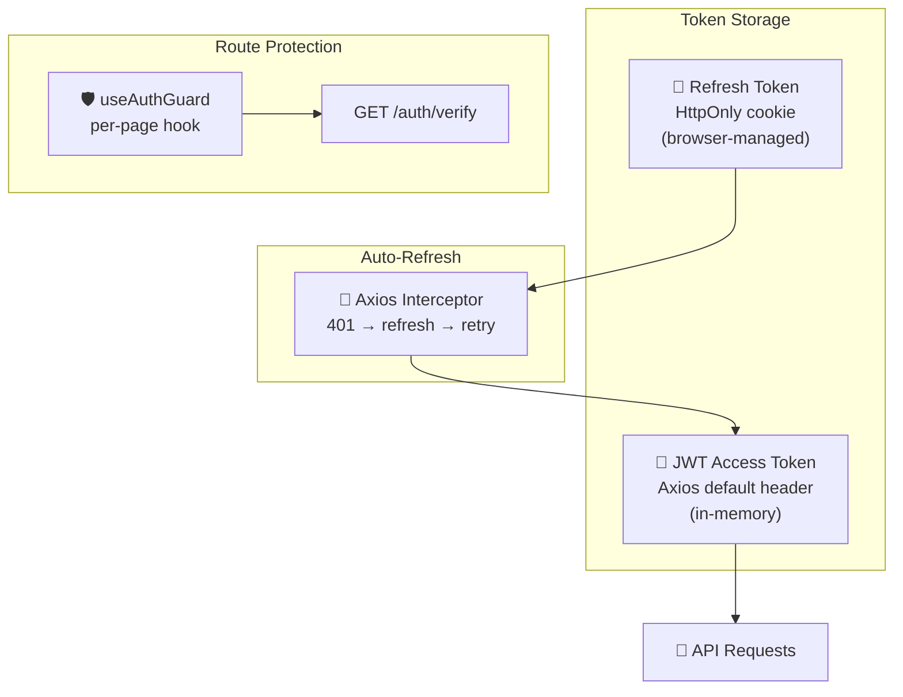
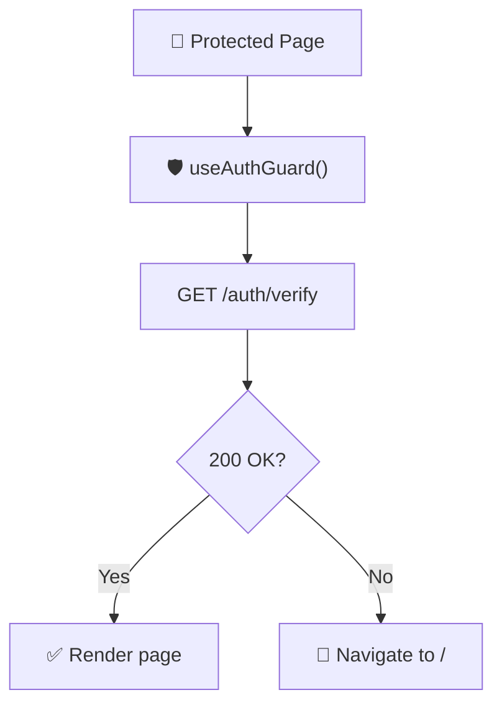
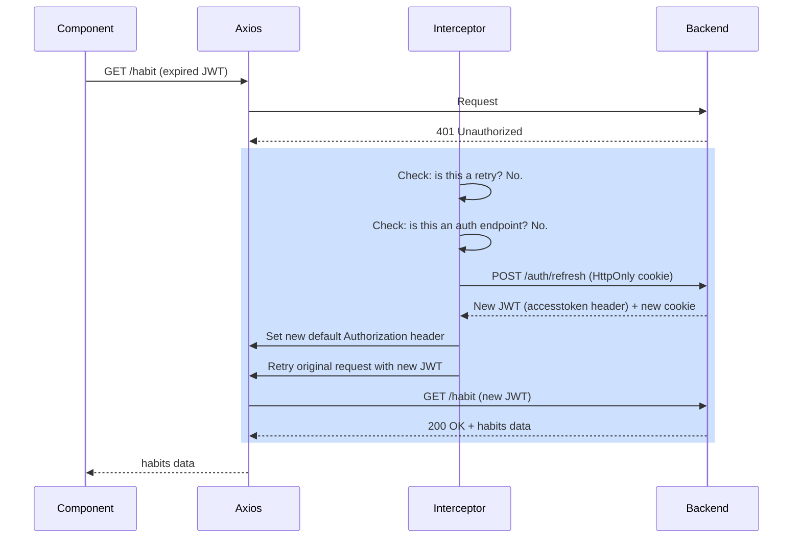
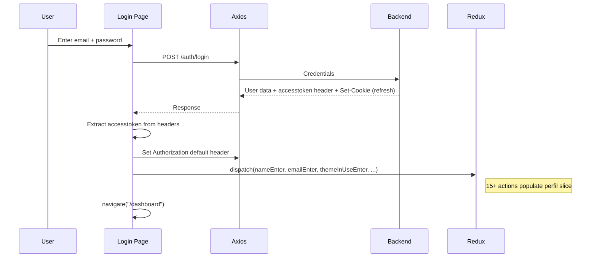
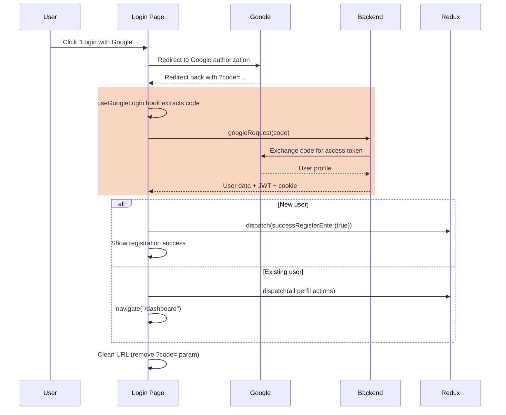
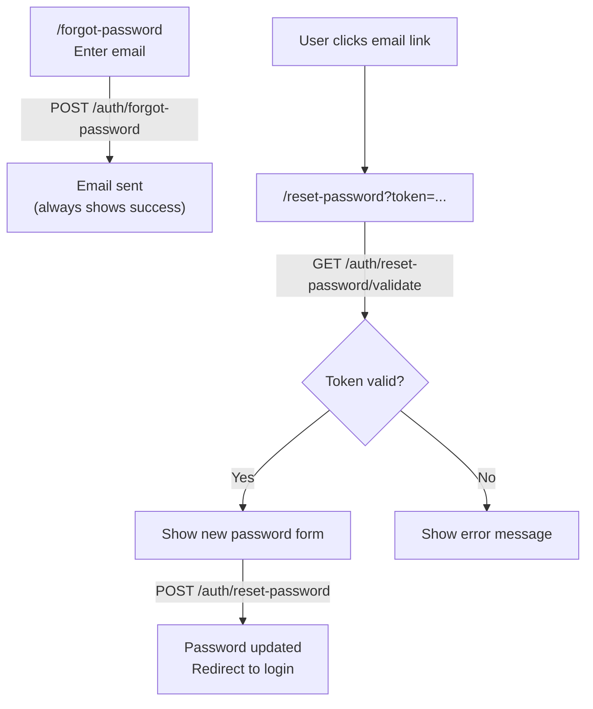

This document explains the frontend-side security architecture: how tokens are stored and refreshed, how routes are protected, how the Axios interceptor works, and how Google OAuth integrates.

## Security Overview

**Key design decisions:**

- JWT stored in Axios defaults (memory) — not localStorage, not sessionStorage
- Refresh token in HttpOnly cookie — invisible to JavaScript, immune to XSS
- No route-level guards in the router config — each page guards itself via hook
- Automatic token refresh transparent to the user

## Token Storage

| Token | Where | How | Why |
|-------|-------|-----|-----|
| **Access JWT** | Axios default headers | Set after login: axios.defaults.headers.common.Authorization | In-memory only — cleared on page refresh, but restored via refresh token |
| **Refresh Token** | HttpOnly cookie | Set by backend via Set-Cookie header | JavaScript cannot access it — prevents XSS theft |

### What happens on page refresh

1. Axios default header is lost (memory cleared)
2. Page calls useAuthGuard → GET /auth/verify
3. Request fails with 401 (no JWT)
4. Axios interceptor catches 401, sends POST /auth/refresh (cookie sent automatically)
5. Backend returns new JWT in response header
6. Interceptor sets new JWT in Axios defaults
7. Original request retries with new JWT

The user sees none of this — the page loads normally.

## Route Protection

### useAuthGuard Hook

Every protected page calls this hook at the top of the component:

The hook runs on mount. If the verification fails (and the interceptor's refresh also fails), the user is redirected to the login page.

**Applied to:** Dashboard, Categories, Habits, Goals, Tasks, Routines, Configuration — all 7 protected pages.

**Not applied to:** Login, Register, Forgot Password, Reset Password — public pages.

## Axios Interceptor

The interceptor is the core of the auto-refresh system. It intercepts every 401 response and attempts to refresh the token before giving up.

### Interceptor rules

| Condition | Action |
|-----------|--------|
| Response is 401 AND request has not been retried | Attempt refresh, then retry |
| Response is 401 AND request was already retried | Redirect to login |
| Request URL is /auth/refresh, /auth/login, or /auth/google | Skip interceptor (prevent infinite loop) |
| Refresh fails | Redirect to login (window.location.href = "/") |
| Any other error | Pass through normally |

### Credentials configuration

Axios is configured with withCredentials: true, which means:

- Cookies are included in every cross-origin request
- The refresh token cookie is automatically sent with POST /auth/refresh
- No manual cookie handling needed in frontend code

## Login Flow

### Email + Password

### Google OAuth

The useGoogleLogin hook:

- Runs once on mount (codeUsed flag prevents re-execution)
- Extracts authorization code from URL query params
- Calls backend to exchange code for user data
- Cleans the URL with history.replaceState to remove the code parameter
- Handles both new user registration and existing user login

## Password Reset (Frontend Side)

The frontend handles:

- Forgot password form with email input
- Extracting the token from URL query params
- Validating the token before showing the form
- Submitting the new password
- Redirecting to login on success

## What the Frontend Does NOT Do

Understanding what is handled server-side vs client-side:

| Security Concern | Frontend | Backend |
|-----------------|----------|---------|
| Password hashing | Never — sends plaintext over HTTPS | BCrypt hashing |
| Token creation | Never | JWT generation + refresh token creation |
| Token validation | Never — relies on 401 responses | HMAC256 signature + expiry check |
| Refresh token storage | Never touches it | HttpOnly cookie management |
| CORS | Sends withCredentials: true | Validates origin pattern |
| Rate limiting | None | None (improvement opportunity) |

## Security Strengths

- **XSS resistance** — refresh token in HttpOnly cookie cannot be read by JavaScript. Even if an XSS attack injects code, it cannot extract the refresh token.
- **No persistent JWT** — access token lives only in Axios defaults (memory). Page refresh clears it. No localStorage or sessionStorage exposure.
- **Automatic refresh** — users never see token expiration. The interceptor handles it invisibly.
- **Clean URL after OAuth** — authorization code is removed from the URL via replaceState, preventing code leakage in browser history or referrer headers.

## Security Considerations

| Area | Current State | Note |
|------|--------------|------|
| JWT in memory | Cleared on refresh, restored via interceptor | Best practice for SPAs |
| HttpOnly cookie | Backend-managed, JS cannot access | Immune to XSS token theft |
| withCredentials | Enabled globally | Required for cookie-based auth |
| Base URL | Hardcoded IP in axiosConfig | Should be environment variable for production |
| Error messages | Generic errors shown to user | Prevents information disclosure |
| Google OAuth code | Cleaned from URL after use | Prevents replay from browser history |
