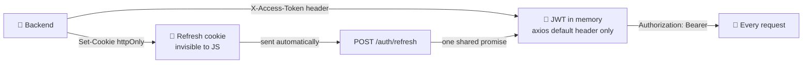

This document explains what the web frontend does about security, and just as importantly what it refuses to do: the browser is untrusted territory, so every real decision belongs to the backend, and the frontend's job is to not undermine it.

## Token handling

```mermaid
flowchart LR
  BE["🍃 Backend"] -->|"X-Access-Token header"| MEM["🔑 JWT in memory<br/>axios default header only"]
  BE -->|"Set-Cookie httpOnly"| CK["🍪 Refresh cookie<br/>invisible to JS"]
  MEM -->|"Authorization: Bearer"| API["📡 Every request"]
  CK -->|"sent automatically"| REF["POST /auth/refresh"]
  REF -->|"one shared promise"| MEM
```

The access token exists in exactly one place: the axios default Authorization header, in memory. It is never written to localStorage, sessionStorage, or a cookie, and it arrives only in the `X-Access-Token` response header. The refresh token is an httpOnly cookie the JavaScript never reads.

A page reload therefore loses the access token by design, and `useSilentRefresh` runs before the router mounts: it trades the cookie for a fresh token, re-fetches the profile, and holds the whole app in a checking state meanwhile, so protected pages never flash or fire unauthorized requests during boot. Concurrent 401s share one refresh through a module-level promise, and when the refresh itself fails the app reports the failure, hard-navigates to login, and rejects with the original 401 so an expired session is not misfiled as an unknown fault.

## Route guards, honestly labeled

- **ProtectedRoute** wraps every authenticated page as a layout route. It admits a user when the boot check succeeded or when a runtime token exists; the second condition matters because the boot state is computed once, and a fresh login sets the token without re-running it.
- **useAuthGuard** remains as a per-page second opinion, probing the session endpoint and bouncing to login on failure.
- **AdminRoute** is the interesting one, and its own comments insist on the honest framing: it is ergonomics, not security. The profile payload deliberately carries no role, because a role the client could read is a role the client could lie about. The gate instead probes the cheapest admin-only endpoint and treats any failure as denial. The real boundary is the backend's role rule; this component just spares non-admins a broken page, and it is lazy-loaded so they never even download it.

## Persistence and teardown

Redux state persists to localStorage with three slices blacklisted: the profile (name, e-mail, photo are PII), snapshots (history is PII by accumulation), and the celebration queue (transient). The cost is re-hydrating the profile from the API on every boot, and the app pays it knowingly.

Logout purges the persistor and hard-navigates, which discards the in-memory token and store together. Account deletion goes further, in a sequence whose details all exist because of past bugs:

1. Purge the persistor, in its own try block.
2. Sweep localStorage by the app's key prefix rather than a hardcoded list (a list is correct the day it is written and silently wrong the first time someone adds a key), collecting keys before deleting (removing during the walk skips every second key), preserving only the theme, which is a machine setting rather than account data. Then clear sessionStorage.
3. Hard-navigate away, unconditionally, so even a storage-disabled browser cannot strand someone inside a deleted account.

The two storage steps are deliberately not chained: a rejected purge previously jumped to the catch and skipped the sweep, which was the worst pairing, since the persisted blob is the one key the prefix sweep cannot catch.

## Google OAuth on the client

The login button generates a random state value, stashes it in sessionStorage, and sends it along. The callback reads the stored value and removes it before comparing, so it is single-use on every outcome, and bails loudly on a mismatch. The authorization code is exchanged once (a flag prevents re-runs) and then scrubbed from the URL, keeping it out of history and referrers. The button renders nothing at all when the client id is not configured.

## Input validation

All form schemas live in the shared validation package. The password policy is enforced where it matters twice: registration and reset require 12+ characters with at least 2 of 4 character classes, mirrored by live hints in the UI, while the login schema deliberately checks only presence, because accounts predating the policy must still be able to sign in.

## The XSS surface

- Application code contains zero uses of dangerouslySetInnerHTML.
- The one place user-influenced rich text renders, the agent chat, goes through react-markdown, which ignores raw HTML by default; no raw-HTML plugin is installed. Links get a custom renderer: internal paths go through the router, external ones open in a new tab with noopener.
- i18next's escaping is off only because React's own escaping covers every interpolation path.
- Admin attachment images are fetched through the authenticated client into object URLs rather than pointing an image tag at a URL the backend would refuse.

## Environment and build hygiene

The bundle reads six environment values, all public by nature: the API base, the app URL, the Google client id, a support address, and the telemetry DSN. Build-time secrets (the source-map upload credentials) are read only in the Vite config from the process environment and can never reach the bundle. Redux DevTools are off in production via Redux Toolkit's default, though nothing asserts it explicitly.

Source maps get three independent guards: the build emits hidden maps (no sourceMappingURL comment for a browser to follow), the upload plugin deletes them from the image after pushing them to the error tracker, and nginx returns 404 for map files anyway, with that rule placed before the static-asset rule that would otherwise match.

Telemetry is dormant without a DSN and configured to never send default PII. One specific scrubber earns its mention: the request URL is stripped of query strings before sending, because two screens carry live single-use credentials in theirs (the reset and verification tokens), which would otherwise sit in the error tracker for its whole retention window.

## The headers nginx serves

The web container's nginx sets, on every response including errors: frame denial, nosniff, strict-origin referrer policy, a permissions policy denying camera, microphone, and geolocation, and HSTS for a year without preload (preload is a one-way door that belongs to whoever owns the domain, not to a container config).

The CSP ships as Report-Only for now, with the enforcing move blocked on one known problem: the telemetry collector's host is baked in at build time, and a CSP that forgets it fails silently, since error reporting just stops. The plan is boring on purpose: collect violations, add the real hosts, rename the header. One nginx trap is handled and worth remembering: add_header inside a location block replaces the inherited set, so the static-asset block re-declares what it needs.

## What the frontend never does

| Concern | Where it lives |
|---------|----------------|
| Password hashing | Backend only; the client sends plaintext over TLS |
| Token creation and validation | Backend; the client reacts to 401s |
| Role decisions | Backend path rules; the client holds no role at all |
| Rate limiting | Backend tiers; the client just renders the 429 toast |
| Ownership checks | Backend services; the client cannot even express another user's id |
