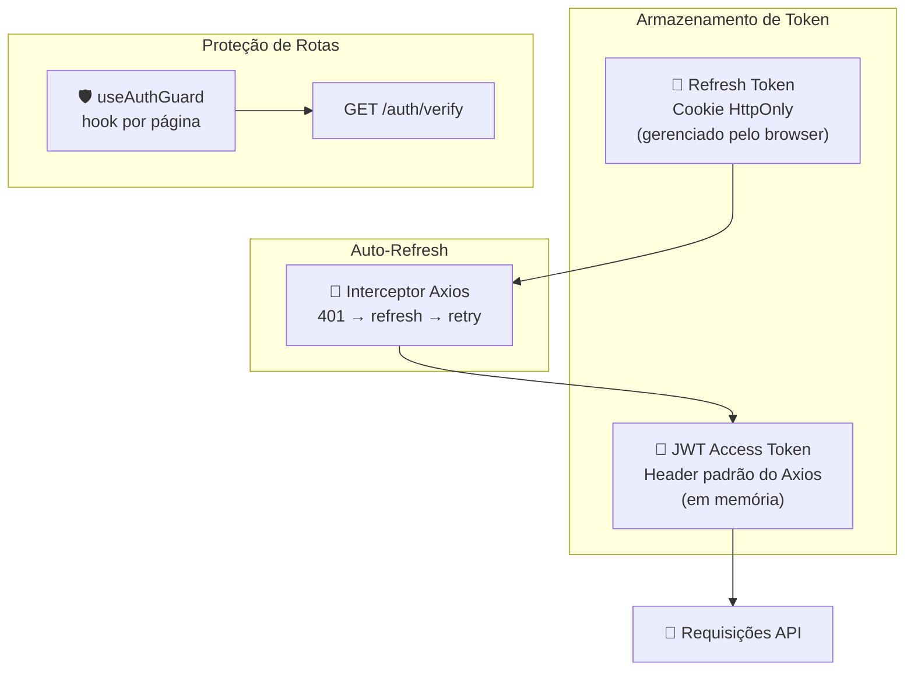
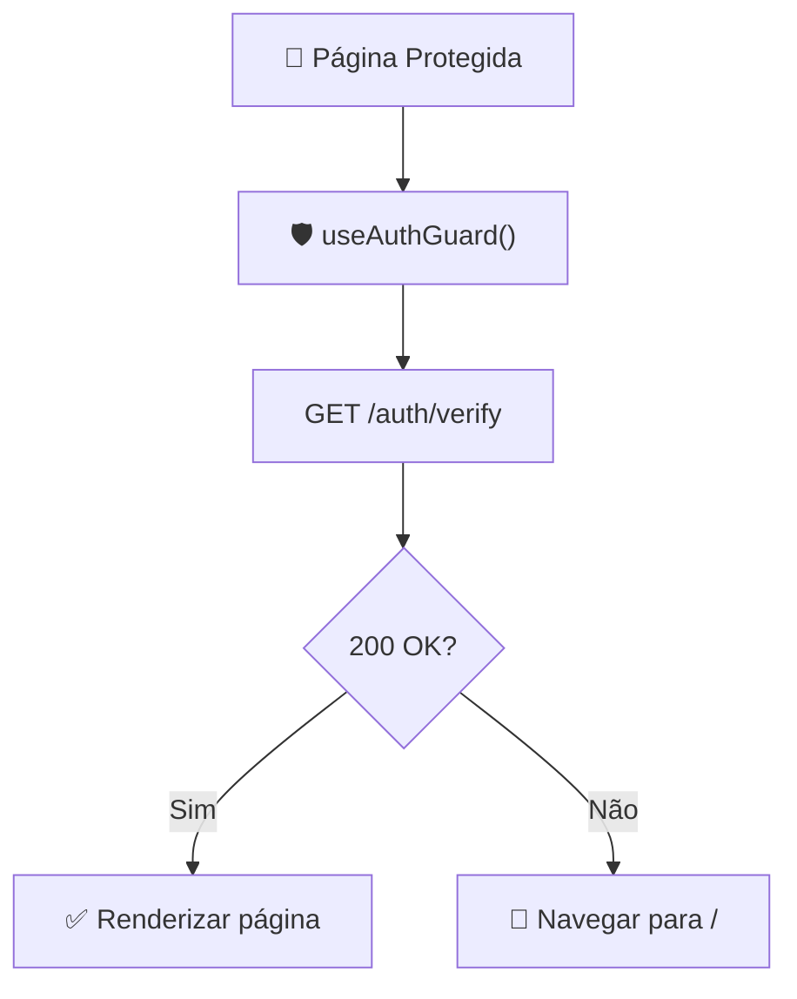
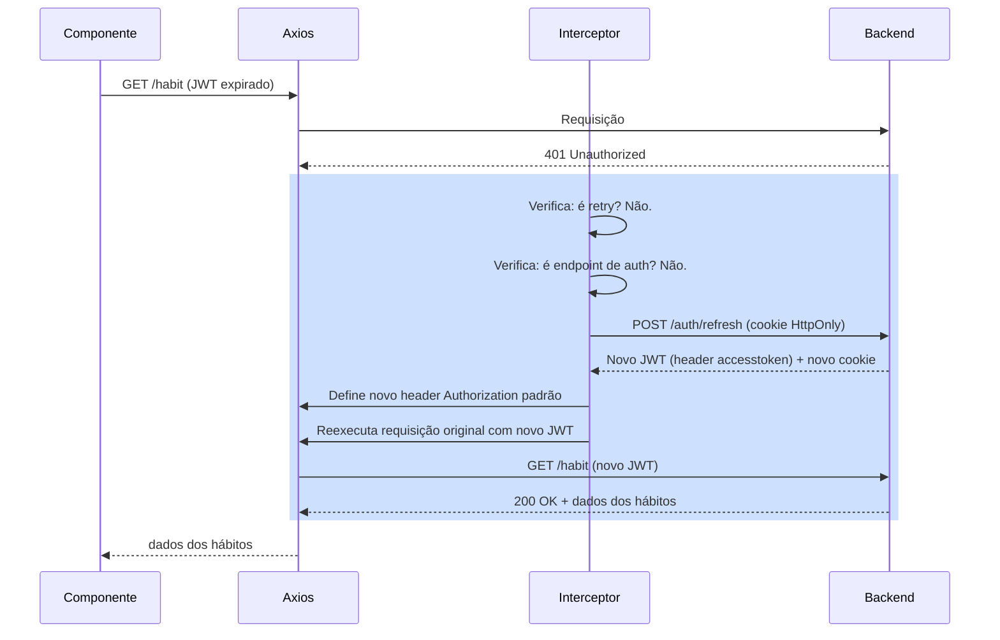
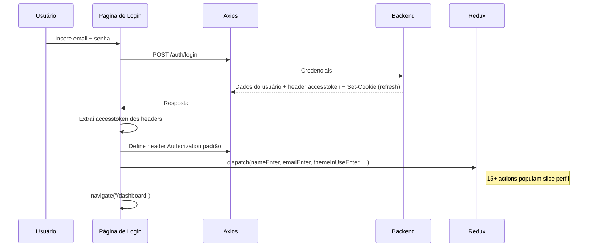
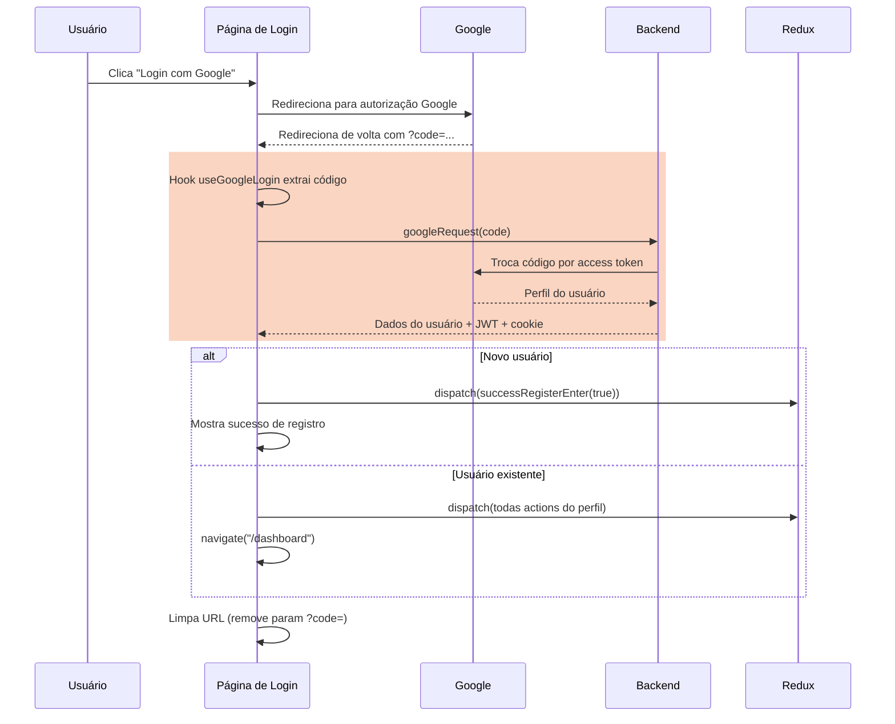
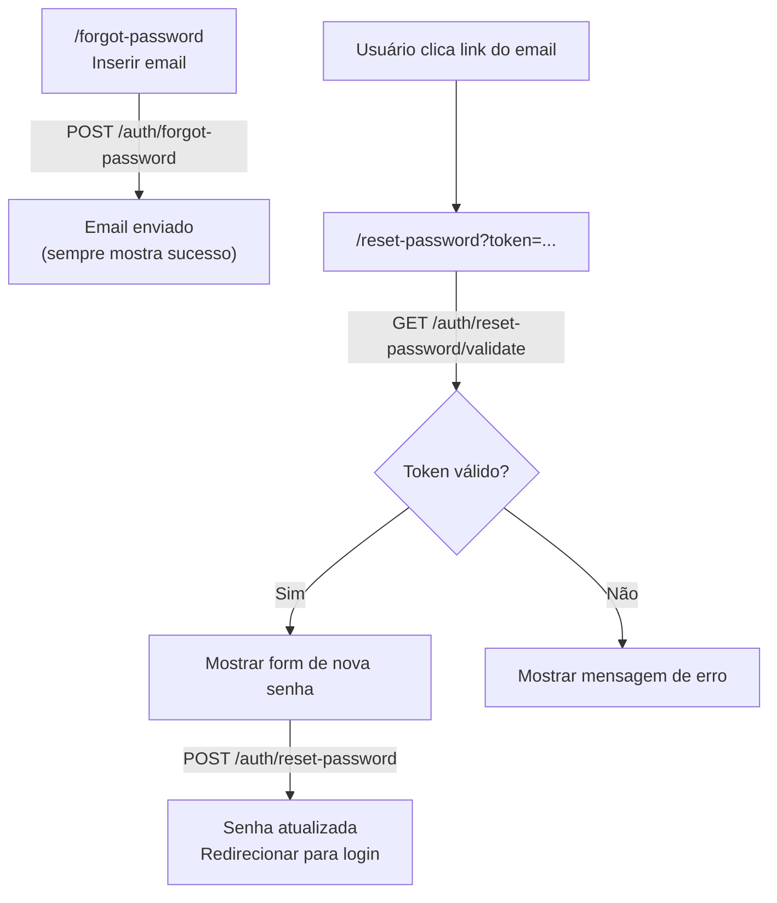

Este documento explica a arquitetura de segurança do lado do frontend: como tokens são armazenados e renovados, como rotas são protegidas, como o interceptor do Axios funciona e como o Google OAuth se integra.

## Visão Geral de Segurança

**Decisões de design principais:**

- JWT armazenado nos defaults do Axios (memória) — não no localStorage, não no sessionStorage
- Refresh token em cookie HttpOnly — invisível ao JavaScript, imune a XSS
- Sem guards no nível do router — cada página se protege via hook
- Refresh automático de token transparente ao usuário

## Armazenamento de Tokens

| Token | Onde | Como | Por quê |
|-------|------|------|---------|
| **JWT de Acesso** | Headers padrão do Axios | Definido após login: axios.defaults.headers.common.Authorization | Apenas em memória — limpo no refresh de página, mas restaurado via refresh token |
| **Refresh Token** | Cookie HttpOnly | Definido pelo backend via header Set-Cookie | JavaScript não pode acessar — previne roubo via XSS |

### O que acontece no refresh de página

1. Header padrão do Axios é perdido (memória limpa)
2. Página chama useAuthGuard → GET /auth/verify
3. Requisição falha com 401 (sem JWT)
4. Interceptor do Axios captura 401, envia POST /auth/refresh (cookie enviado automaticamente)
5. Backend retorna novo JWT no header da resposta
6. Interceptor define novo JWT nos defaults do Axios
7. Requisição original é reexecutada com novo JWT

O usuário não vê nada disso — a página carrega normalmente.

## Proteção de Rotas

### Hook useAuthGuard

Toda página protegida chama este hook no topo do componente:

O hook roda no mount. Se a verificação falha (e o refresh do interceptor também falha), o usuário é redirecionado para a página de login.

**Aplicado a:** Dashboard, Categories, Habits, Goals, Tasks, Routines, Configuration — todas as 7 páginas protegidas.

**Não aplicado a:** Login, Register, Forgot Password, Reset Password — páginas públicas.

## Interceptor do Axios

O interceptor é o núcleo do sistema de auto-refresh. Ele intercepta toda resposta 401 e tenta renovar o token antes de desistir.

### Regras do interceptor

| Condição | Ação |
|----------|------|
| Resposta é 401 E requisição não foi reexecutada | Tentar refresh, depois reexecutar |
| Resposta é 401 E requisição já foi reexecutada | Redirecionar para login |
| URL da requisição é /auth/refresh, /auth/login ou /auth/google | Pular interceptor (prevenir loop infinito) |
| Refresh falha | Redirecionar para login (window.location.href = "/") |
| Qualquer outro erro | Passar normalmente |

### Configuração de credenciais

Axios é configurado com withCredentials: true, o que significa:

- Cookies são incluídos em toda requisição cross-origin
- O cookie do refresh token é automaticamente enviado com POST /auth/refresh
- Nenhum manuseio manual de cookies necessário no código frontend

## Fluxo de Login

### Email + Senha

### Google OAuth

O hook useGoogleLogin:

- Roda uma vez no mount (flag codeUsed previne re-execução)
- Extrai código de autorização dos query params da URL
- Chama backend para trocar código por dados do usuário
- Limpa a URL com history.replaceState para remover o parâmetro code
- Lida com tanto registro de novo usuário quanto login de usuário existente

## Reset de Senha (Lado Frontend)

O frontend lida com:

- Formulário de esqueci a senha com input de email
- Extração do token dos query params da URL
- Validação do token antes de mostrar o formulário
- Submissão da nova senha
- Redirecionamento para login no sucesso

## O que o Frontend NÃO Faz

Entendendo o que é tratado no servidor vs no cliente:

| Preocupação de Segurança | Frontend | Backend |
|--------------------------|----------|---------|
| Hash de senha | Nunca — envia texto simples via HTTPS | BCrypt hashing |
| Criação de token | Nunca | Geração JWT + criação de refresh token |
| Validação de token | Nunca — depende de respostas 401 | Assinatura HMAC256 + verificação de expiração |
| Armazenamento de refresh token | Nunca toca nele | Gerenciamento de cookie HttpOnly |
| CORS | Envia withCredentials: true | Valida padrão de origem |
| Rate limiting | Nenhum | Nenhum (oportunidade de melhoria) |

## Pontos Fortes de Segurança

- **Resistência a XSS** — refresh token em cookie HttpOnly não pode ser lido por JavaScript. Mesmo se um ataque XSS injetar código, não consegue extrair o refresh token.
- **Sem JWT persistente** — access token vive apenas nos defaults do Axios (memória). Refresh de página limpa ele. Sem exposição em localStorage ou sessionStorage.
- **Refresh automático** — usuários nunca veem expiração de token. O interceptor lida invisivelmente.
- **URL limpa após OAuth** — código de autorização é removido da URL via replaceState, prevenindo vazamento do código no histórico do browser ou headers de referrer.

## Considerações de Segurança

| Área | Estado Atual | Nota |
|------|-------------|------|
| JWT em memória | Limpo no refresh, restaurado via interceptor | Melhor prática para SPAs |
| Cookie HttpOnly | Gerenciado pelo backend, JS não acessa | Imune a roubo de token XSS |
| withCredentials | Habilitado globalmente | Necessário para auth baseada em cookie |
| URL Base | IP hardcoded no axiosConfig | Deve ser variável de ambiente para produção |
| Mensagens de erro | Erros genéricos mostrados ao usuário | Previne divulgação de informação |
| Código Google OAuth | Limpo da URL após uso | Previne replay do histórico do browser |
