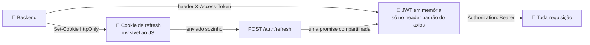

Este documento explica o que o frontend web faz sobre segurança e, igualmente importante, o que ele se recusa a fazer: o navegador é território não confiável, então toda decisão real pertence ao backend, e o trabalho do frontend é não miná-lo.

## Manejo de tokens

```mermaid
flowchart LR
  BE["🍃 Backend"] -->|"header X-Access-Token"| MEM["🔑 JWT em memória<br/>só no header padrão do axios"]
  BE -->|"Set-Cookie httpOnly"| CK["🍪 Cookie de refresh<br/>invisível ao JS"]
  MEM -->|"Authorization: Bearer"| API["📡 Toda requisição"]
  CK -->|"enviado sozinho"| REF["POST /auth/refresh"]
  REF -->|"uma promise compartilhada"| MEM
```

O access token existe em exatamente um lugar: o header Authorization padrão do axios, em memória. Nunca é escrito em localStorage, sessionStorage ou cookie, e só chega pelo header de resposta `X-Access-Token`. O refresh token é um cookie httpOnly que o JavaScript nunca lê.

Um reload da página, portanto, perde o access token por design, e o `useSilentRefresh` roda antes de o router montar: troca o cookie por um token fresco, rebusca o perfil e segura o app inteiro em um estado de checagem enquanto isso, para páginas protegidas nunca piscarem nem dispararem requisições sem autorização durante o boot. 401s simultâneos dividem um único refresh por uma promise de módulo, e quando o próprio refresh falha o app reporta a falha, navega duro para o login e rejeita com o 401 original, para uma sessão expirada não ser arquivada como falha desconhecida.

## Guardas de rota, com etiqueta honesta

- **ProtectedRoute** envolve toda página autenticada como rota de layout. Admite o usuário quando a checagem de boot passou ou quando existe um token em tempo de execução; a segunda condição importa porque o estado de boot é calculado uma vez, e um login recém-feito define o token sem recalculá-lo.
- **useAuthGuard** permanece como segunda opinião por página, sondando o endpoint de sessão e devolvendo ao login na falha.
- **AdminRoute** é o interessante, e os próprios comentários dele insistem no enquadramento honesto: é ergonomia, não segurança. O payload do perfil deliberadamente não carrega papel nenhum, porque um papel que o cliente pode ler é um papel sobre o qual o cliente pode mentir. O portão sonda o endpoint admin mais barato e trata qualquer falha como negação. A fronteira real é a regra de papel do backend; este componente só poupa não-admins de uma página quebrada, e é carregado de forma lazy para eles nem o baixarem.

## Persistência e desmontagem

O estado do Redux persiste em localStorage com três slices na blacklist: o perfil (nome, e-mail e foto são PII), os snapshots (histórico é PII por acúmulo) e a fila de celebrações (transitória). O custo é re-hidratar o perfil da API a cada boot, e o app paga sabendo.

O logout purga o persistor e navega duro, o que descarta o token em memória e a store juntos. A exclusão de conta vai além, em uma sequência cujos detalhes existem todos por causa de bugs passados:

1. Purgar o persistor, em um try próprio.
2. Varrer o localStorage pelo prefixo de chaves do app em vez de uma lista fixa (uma lista está correta no dia em que é escrita e silenciosamente errada na primeira chave nova), coletando as chaves antes de apagar (remover durante a caminhada pula chave sim, chave não), preservando só o tema, que é configuração da máquina e não dado da conta. Depois, limpar o sessionStorage.
3. Navegar para fora, incondicionalmente, para nem um navegador com storage desabilitado conseguir prender alguém dentro de uma conta apagada.

Os dois passos de storage deliberadamente não são encadeados: um purge rejeitado antes pulava para o catch e saltava a varredura, o pior par possível, já que o blob persistido é a única chave que a varredura por prefixo não alcança.

## Google OAuth no cliente

O botão de login gera um valor de state aleatório, guarda em sessionStorage e o envia junto. O callback lê o valor guardado e o remove antes de comparar, então é de uso único em qualquer desfecho, e desiste ruidosamente em caso de divergência. O código de autorização é trocado uma vez (uma flag impede repetição) e depois esfregado da URL, mantendo-o fora do histórico e dos referrers. O botão não renderiza nada quando o client id não está configurado.

## Validação de entrada

Todos os schemas de formulário vivem no pacote compartilhado de validação. A política de senha é imposta duas vezes onde importa: cadastro e reset exigem 12+ caracteres com pelo menos 2 de 4 classes, espelhados por dicas ao vivo na UI, enquanto o schema de login deliberadamente checa só a presença, porque contas anteriores à política ainda precisam entrar.

## A superfície de XSS

- O código da aplicação tem zero usos de dangerouslySetInnerHTML.
- O único lugar onde texto rico influenciado pelo usuário renderiza, o chat do agente, passa pelo react-markdown, que ignora HTML cru por padrão; nenhum plugin de HTML cru está instalado. Links ganham renderizador próprio: caminhos internos vão pelo router, externos abrem em aba nova com noopener.
- O escape do i18next fica desligado só porque o escape do próprio React cobre todo caminho de interpolação.
- Imagens de anexo do admin são buscadas pelo cliente autenticado para object URLs, em vez de apontar uma tag de imagem para uma URL que o backend recusaria.

## Higiene de ambiente e build

O bundle lê seis valores de ambiente, todos públicos por natureza: a base da API, a URL do app, o client id do Google, um endereço de suporte e o DSN de telemetria. Segredos de build (as credenciais de upload de source map) são lidos só na configuração do Vite pelo ambiente do processo e nunca alcançam o bundle. O Redux DevTools fica desligado em produção pelo padrão do Redux Toolkit, embora nada o afirme explicitamente.

Os source maps ganham três guardas independentes: o build emite mapas ocultos (sem comentário sourceMappingURL para um navegador seguir), o plugin de upload os apaga da imagem depois de enviá-los ao rastreador de erros, e o nginx devolve 404 para arquivos de mapa de qualquer forma, com essa regra antes da regra de estáticos que casaria com eles.

A telemetria fica dormente sem DSN e configurada para nunca enviar PII padrão. Um limpador específico merece a menção: a URL da requisição perde a query string antes do envio, porque duas telas carregam credenciais vivas de uso único nas suas (os tokens de reset e verificação), que de outro modo ficariam no rastreador por toda a janela de retenção.

## Os headers que o nginx serve

O nginx do container web define, em toda resposta incluindo erros: negação de frames, nosniff, política de referrer strict-origin, uma política de permissões negando câmera, microfone e geolocalização, e HSTS por um ano sem preload (preload é uma porta sem volta que pertence a quem é dono do domínio, não a uma configuração de container).

O CSP sai como Report-Only por enquanto, com a promoção travada em um problema conhecido: o host do coletor de telemetria entra no build, e um CSP que o esquece falha em silêncio, já que o reporte de erros simplesmente para. O plano é chato de propósito: coletar violações, adicionar os hosts reais, renomear o header. Uma armadilha do nginx está tratada e vale lembrar: add_header dentro de um location substitui o conjunto herdado, então o bloco de estáticos redeclara o que precisa.

## O que o frontend nunca faz

| Preocupação | Onde vive |
|-------------|-----------|
| Hash de senha | Só no backend; o cliente envia texto puro sobre TLS |
| Criação e validação de token | Backend; o cliente reage a 401s |
| Decisões de papel | Regras de caminho do backend; o cliente não guarda papel algum |
| Rate limiting | Faixas do backend; o cliente só renderiza o toast de 429 |
| Checagens de posse | Services do backend; o cliente nem consegue expressar o id de outro usuário |
