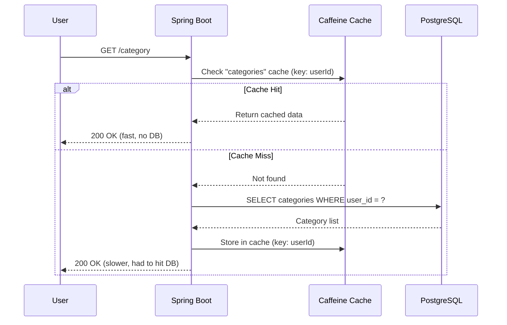

Every request in Beyou was hitting the database. Every single one. It didn't matter if you just opened the app 5 seconds ago and nothing changed, the backend would still go to PostgreSQL, open a connection, run the query, and return the same data. For a personal app with a few users, that's fine. But when I started thinking about what happens with hundreds of concurrent users, the picture wasn't great.

So I decided to add a cache layer. This post covers the problem, what I built, how the architecture works, and the actual performance numbers I measured before and after.

## The Problem

In Beyou, pretty much everything is a read. You open the app, you see your categories, habits, tasks, goals, routines. That's 5-6 database queries just to load the main views. And the thing is, this data doesn't change that often. A user might check a habit once or twice a day, but they'll read their habit list dozens of times.

The real issue is database connections. PostgreSQL has a limited connection pool (managed by HikariCP in our case). Every read takes a connection from the pool, runs the query, and returns it. Under normal load that's fine. But if a spike of users all hit the app at the same time, they all compete for connections. Some requests start waiting in a queue, latency goes up, and the experience degrades.

The fix is simple in concept: don't go to the database if you already have the answer. That's what a cache does.

## Measuring Before (The Baseline)

Before writing any cache code, I needed to know where I was starting from. You can't improve what you don't measure, right?

I wrote k6 load test scripts that simulate realistic traffic patterns, reading categories, habits, tasks, goals, routines, and docs. The scripts run multiple virtual users concurrently, hitting all the read endpoints in a loop.

For the docs endpoints, I also used autocannon with 200 concurrent connections to stress test a single endpoint and see how it behaves under heavy load.

The baseline numbers told me what I already suspected: response times were acceptable for light usage, but the p95 latencies were high. The docs endpoints were averaging 32ms per request with p95 at 84ms. The domain endpoints (the ones behind authentication) were even worse, 64ms average with p95 at 108ms. Category listing had a p95 of over 1.3 seconds, which is not great.

## The Architecture

I chose Caffeine as the cache library. It's an in-memory cache that runs inside the JVM, no external infrastructure like Redis needed. For a single-server app like Beyou, this is perfect. It's fast, simple, and Spring Boot has first-class integration with it.

### Two Cache Tiers

Not all data is the same, so the cache has two tiers:

**Domain caches** (categories, habits, tasks, goals, routines, schedules): These are user-scoped data that changes when users interact with the app. TTL of 30 minutes, max 500 entries per cache. The TTL acts as a safety net, even if something goes wrong with eviction, data won't be stale for more than 30 minutes.

**Reference cache** (XpByLevel): This is a static lookup table that maps levels to XP thresholds. It never changes at runtime (it's seed data), so it's cached permanently with no TTL. 100 entries max, one per level.

The docs caches (API docs, architecture docs, blog, projects) use a separate global fallback: 30 entries max, 120-minute TTL. This data only changes when we re-import documentation from the GitHub repo.

### The Cache Flow

Here's how a cached read works:



The first request for each user after a cache miss goes to the database. Every subsequent request for the same data comes straight from memory.

### Cache Eviction Strategy

This is where it gets interesting. The tricky part isn't caching reads, it's knowing when to invalidate the cache after writes.

In Beyou, a single user action can touch multiple entities. For example, checking a habit in a routine triggers XP calculations that update the User, the Routine, the Habit, and all linked Categories. That's potentially 5+ entities changing in one transaction.

Instead of trying to surgically invalidate individual cache entries (which would be complex and error-prone), I went with a broader approach: **evict all of a user's caches on any write operation**.

I created a centralized `UserCacheEvictService` with a single method:

```java
@Service
@RequiredArgsConstructor
public class UserCacheEvictService {

    private final CacheManager cacheManager;

    @Caching(evict = {
        @CacheEvict(cacheNames = "categories", key = "#userId"),
        @CacheEvict(cacheNames = "habits", key = "#userId"),
        @CacheEvict(cacheNames = "tasks", key = "#userId"),
        @CacheEvict(cacheNames = "goals", key = "#userId"),
        @CacheEvict(cacheNames = "routines", key = "#userId"),
        @CacheEvict(cacheNames = "todayRoutine", key = "#userId"),
        @CacheEvict(cacheNames = "schedules", key = "#userId")
    })
    public void evictAllUserCaches(UUID userId) {
        Cache routineCache = cacheManager.getCache("routine");
        if (routineCache != null) {
            routineCache.clear();
        }
    }
}
```

Every service that does a write (create, edit, delete, check a habit, complete a goal, etc.) calls `userCacheEvictService.evictAllUserCaches(userId)` as the last thing before returning. This way:

- The cache is always consistent with the database
- No stale data is ever served after a mutation
- Adding a new cache in the future means adding one line here
- The 30-minute TTL acts as a safety net for edge cases

This is the right trade-off for Beyou. The typical user pattern is mostly reads with occasional writes throughout the day. When they do write, all their caches get cleared, and the next read repopulates them. The overhead of clearing a few cache entries is nothing compared to the savings from all the reads that hit cache.

### A Small Refactor: Task Cleanup

While adding caching to the task service, I noticed something: `getAllTasks()` had a side effect. Every time you fetched the task list, it also deleted one-time tasks that were marked for removal. That made it impossible to cache because the "read" was also doing writes.

I moved that cleanup logic into a `@Scheduled` job that runs at midnight. Now `getAllTasks()` is a pure read, safe to cache. And the cleanup happens once a day instead of on every single task list fetch, which is actually cleaner.

## The Results

After implementing the cache, I ran the exact same k6 scripts and autocannon tests. Here's what happened.

### Docs Endpoints

| Metric | Before | After | Improvement |
|--------|--------|-------|-------------|
| p50 latency | 21.90 ms | 5.32 ms | **75.7% faster** |
| p95 latency | 84.10 ms | 33.02 ms | **60.7% faster** |
| Average | 32.51 ms | 9.18 ms | **71.8% faster** |
| Max | 1203.74 ms | 188.11 ms | **84.4% faster** |
| Throughput | 455 req/s | 974 req/s | **114% more** |

Some individual endpoints saw even bigger improvements. Projects list went from 107ms to 11ms at p95, that's an **89.3% reduction**. Blog list p95 dropped from 84ms to 11ms, **86.6% faster**.

With autocannon pushing 200 concurrent connections against a single docs endpoint, the server handled **1,494 req/s** with a p50 of 129ms. That's solid for an in-memory cache on a single server.

### Domain Endpoints (Authenticated)

| Metric | Before | After | Improvement |
|--------|--------|-------|-------------|
| p50 latency | 30.85 ms | 16.03 ms | **48.1% faster** |
| p95 latency | 108.05 ms | 65.65 ms | **39.2% faster** |
| Average | 64.68 ms | 37.10 ms | **42.6% faster** |
| Throughput | 257 req/s | 401 req/s | **55.6% more** |

The big winner here was the category listing: p95 went from **1,319ms to 104ms**, a **92.1% improvement**. That one endpoint alone was sometimes taking over a second under load, and now it's consistently under 100ms.

The domain endpoints show smaller improvements than docs because they have the overhead of JWT authentication on every request. But 48% faster at p50 and 55% more throughput is still a significant win.

## Monitoring

All the cache stats are exported to Prometheus via Micrometer (which Caffeine supports natively with `.recordStats()`). I built a Grafana dashboard that shows:

- Cache hit rate per cache (the main metric to watch)
- Hits vs misses over time
- Cache size (how many entries are stored)
- Eviction rate
- Put rate (new entries being cached)

This lets me see in real time if the cache is doing its job. Right after deploying, I could watch the hit rate climb from 0% to 80%+ as users started hitting cached data.

## What I Learned

A few things stood out during this work:

**Measure first.** Having the k6 baseline made the whole project more grounded. I knew exactly what I was optimizing and could validate the improvements with real numbers.

**Broad eviction is fine.** I initially worried that clearing all caches on any write would be wasteful. In practice, the read-to-write ratio is so high that it doesn't matter. A user might trigger 50 cache hits before one write clears everything. The math works out heavily in favor of caching.

**Spring AOP proxies have gotchas.** I learned (the hard way) that `@CacheEvict` on a method called internally within the same class doesn't work, the call bypasses the Spring proxy. The fix was putting `@CacheEvict` on the public method that external callers use, not on internal helper methods.

**Separate reads from writes.** The task cleanup refactor was a good reminder that mixing side effects into read operations makes everything harder, not just for caching, but for reasoning about the code in general.

## What's Next

The cache is in place and working well. Some things I'm considering for the future:

- **Per-cache tuning**: Right now all domain caches share the same 500-entry, 30-minute config. As I get more usage data from Grafana, I might tune individual caches differently.
- **Search caching**: The search endpoint is the slowest remaining path. It might benefit from caching common search queries.
- **Cache warming**: After a server restart, all caches are cold. For the XpByLevel table, I could pre-warm it on startup to avoid the first-request penalty.

For now, I'm happy with the results. The app is faster, the database has more room to breathe, and I have the monitoring in place to keep an eye on things.
