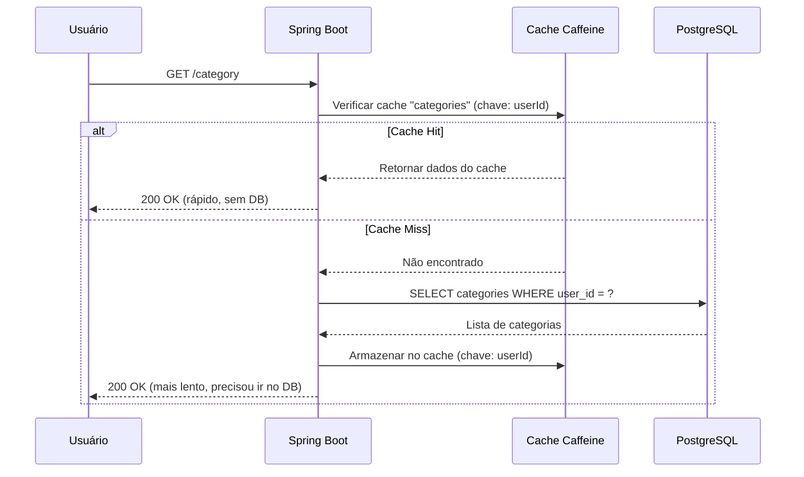

Toda requisição no Beyou estava batendo no banco de dados. Toda. Não importava se você tinha acabado de abrir o app 5 segundos atrás e nada tinha mudado, o backend ainda ia no PostgreSQL, abria uma conexão, rodava a query e retornava os mesmos dados. Pra um app pessoal com poucos usuários, tudo bem. Mas quando comecei a pensar no que acontece com centenas de usuários simultâneos, o cenário não era bom.

Então decidi adicionar uma camada de cache. Esse post cobre o problema, o que eu construí, como a arquitetura funciona e os números reais de performance que medi antes e depois.

## O Problema

No Beyou, praticamente tudo é leitura. Você abre o app, vê suas categorias, hábitos, tarefas, metas, rotinas. São 5-6 queries no banco só pra carregar as telas principais. E o ponto é que esses dados não mudam com tanta frequência. Um usuário pode marcar um hábito uma ou duas vezes por dia, mas vai ler a lista de hábitos dezenas de vezes.

O problema real são as conexões com o banco. O PostgreSQL tem um pool limitado de conexões (gerenciado pelo HikariCP no nosso caso). Cada leitura pega uma conexão do pool, roda a query e devolve. Com carga normal tá de boa. Mas se um pico de usuários bater no app ao mesmo tempo, todos competem por conexões. Algumas requisições começam a esperar na fila, a latência sobe e a experiência degrada.

A solução é simples em conceito: não ir ao banco se você já tem a resposta. É isso que um cache faz.

## Medindo Antes (A Baseline)

Antes de escrever qualquer código de cache, eu precisava saber de onde estava partindo. Não dá pra melhorar o que você não mede, né?

Escrevi scripts de load test com k6 que simulam padrões de tráfego realistas, lendo categorias, hábitos, tarefas, metas, rotinas e docs. Os scripts rodam múltiplos usuários virtuais simultaneamente, batendo em todos os endpoints de leitura em loop.

Pros endpoints de docs, também usei o autocannon com 200 conexões simultâneas pra fazer stress test num único endpoint e ver como ele se comporta sob carga pesada.

Os números da baseline confirmaram o que eu já suspeitava: os tempos de resposta eram aceitáveis pra uso leve, mas as latências p95 eram altas. Os endpoints de docs tinham média de 32ms por requisição com p95 em 84ms. Os endpoints de domínio (os que precisam de autenticação) eram piores ainda, 64ms de média com p95 em 108ms. A listagem de categorias tinha p95 acima de 1.3 segundos, o que não é legal.

## A Arquitetura

Escolhi o Caffeine como biblioteca de cache. É um cache em memória que roda dentro da JVM, sem infraestrutura externa como Redis. Pra uma aplicação single-server como o Beyou, é perfeito. É rápido, simples e o Spring Boot tem integração nativa com ele.

### Dois Níveis de Cache

Nem todo dado é igual, então o cache tem dois níveis:

**Caches de domínio** (categorias, hábitos, tarefas, metas, rotinas, agendamentos): São dados do usuário que mudam quando eles interagem com o app. TTL de 30 minutos, máximo 500 entradas por cache. O TTL funciona como rede de segurança, mesmo se algo der errado com a invalidação, os dados não ficam desatualizados por mais de 30 minutos.

**Cache de referência** (XpByLevel): É uma tabela de lookup estática que mapeia níveis para limites de XP. Nunca muda em runtime (é dado de seed), então é cacheado permanentemente sem TTL. 100 entradas max, uma por nível.

Os caches de docs (docs de API, arquitetura, blog, projetos) usam um fallback global separado: 30 entradas max, TTL de 120 minutos. Esses dados só mudam quando reimportamos a documentação do repositório GitHub.

### O Fluxo do Cache

Assim que uma leitura cacheada funciona:



A primeira requisição de cada usuário depois de um cache miss vai ao banco. Toda requisição subsequente pros mesmos dados vem direto da memória.

### Estratégia de Invalidação do Cache

Aqui que fica interessante. A parte complicada não é cachear leituras, é saber quando invalidar o cache depois de escritas.

No Beyou, uma única ação do usuário pode tocar em múltiplas entidades. Por exemplo, marcar um hábito numa rotina dispara cálculos de XP que atualizam o Usuário, a Rotina, o Hábito e todas as Categorias vinculadas. São potencialmente 5+ entidades mudando numa única transação.

Em vez de tentar invalidar cirurgicamente entradas individuais do cache (o que seria complexo e propenso a erros), fui com uma abordagem mais ampla: **limpar todos os caches do usuário em qualquer operação de escrita**.

Criei um `UserCacheEvictService` centralizado com um único método:

```java
@Service
@RequiredArgsConstructor
public class UserCacheEvictService {

    private final CacheManager cacheManager;

    @Caching(evict = {
        @CacheEvict(cacheNames = "categories", key = "#userId"),
        @CacheEvict(cacheNames = "habits", key = "#userId"),
        @CacheEvict(cacheNames = "tasks", key = "#userId"),
        @CacheEvict(cacheNames = "goals", key = "#userId"),
        @CacheEvict(cacheNames = "routines", key = "#userId"),
        @CacheEvict(cacheNames = "todayRoutine", key = "#userId"),
        @CacheEvict(cacheNames = "schedules", key = "#userId")
    })
    public void evictAllUserCaches(UUID userId) {
        Cache routineCache = cacheManager.getCache("routine");
        if (routineCache != null) {
            routineCache.clear();
        }
    }
}
```

Todo serviço que faz uma escrita (criar, editar, deletar, marcar um hábito, completar uma meta, etc.) chama `userCacheEvictService.evictAllUserCaches(userId)` como última coisa antes de retornar. Dessa forma:

- O cache é sempre consistente com o banco
- Nenhum dado desatualizado é servido após uma mutação
- Adicionar um novo cache no futuro significa adicionar uma linha aqui
- O TTL de 30 minutos age como rede de segurança pra casos extremos

Esse é o trade-off certo pro Beyou. O padrão típico do usuário é majoritariamente leituras com escritas ocasionais ao longo do dia. Quando eles escrevem, todos os caches são limpos e a próxima leitura repopula. O custo de limpar algumas entradas do cache é nada comparado com a economia de todas as leituras que batem no cache.

### Um Pequeno Refactor: Limpeza de Tarefas

Enquanto adicionava cache no serviço de tarefas, notei algo: `getAllTasks()` tinha um efeito colateral. Toda vez que você buscava a lista de tarefas, ele também deletava tarefas únicas que estavam marcadas pra remoção. Isso tornava impossível cachear porque a "leitura" também estava fazendo escritas.

Movi essa lógica de limpeza pra um job `@Scheduled` que roda à meia-noite. Agora `getAllTasks()` é uma leitura pura, seguro de cachear. E a limpeza acontece uma vez por dia em vez de em todo fetch da lista de tarefas, o que na verdade é mais limpo.

## Os Resultados

Depois de implementar o cache, rodei exatamente os mesmos scripts k6 e testes autocannon. Aqui está o que aconteceu.

### Endpoints de Docs

| Métrica | Antes | Depois | Melhoria |
|---------|-------|--------|----------|
| Latência p50 | 21.90 ms | 5.32 ms | **75.7% mais rápido** |
| Latência p95 | 84.10 ms | 33.02 ms | **60.7% mais rápido** |
| Média | 32.51 ms | 9.18 ms | **71.8% mais rápido** |
| Máximo | 1203.74 ms | 188.11 ms | **84.4% mais rápido** |
| Throughput | 455 req/s | 974 req/s | **114% a mais** |

Alguns endpoints individuais tiveram melhorias ainda maiores. Lista de projetos foi de 107ms pra 11ms no p95, uma **redução de 89.3%**. P95 da lista de blog caiu de 84ms pra 11ms, **86.6% mais rápido**.

Com autocannon forçando 200 conexões simultâneas contra um único endpoint de docs, o servidor aguentou **1.494 req/s** com p50 de 129ms. Isso é sólido pra um cache em memória num servidor único.

### Endpoints de Domínio (Autenticados)

| Métrica | Antes | Depois | Melhoria |
|---------|-------|--------|----------|
| Latência p50 | 30.85 ms | 16.03 ms | **48.1% mais rápido** |
| Latência p95 | 108.05 ms | 65.65 ms | **39.2% mais rápido** |
| Média | 64.68 ms | 37.10 ms | **42.6% mais rápido** |
| Throughput | 257 req/s | 401 req/s | **55.6% a mais** |

O grande vencedor aqui foi a listagem de categorias: p95 foi de **1.319ms pra 104ms**, uma **melhoria de 92.1%**. Esse único endpoint às vezes levava mais de um segundo sob carga, e agora consistentemente fica abaixo de 100ms.

Os endpoints de domínio mostram melhorias menores que os de docs porque têm o overhead da autenticação JWT em toda requisição. Mas 48% mais rápido no p50 e 55% mais throughput ainda é uma vitória significativa.

## Monitoramento

Todas as estatísticas do cache são exportadas pro Prometheus via Micrometer (que o Caffeine suporta nativamente com `.recordStats()`). Montei um dashboard no Grafana que mostra:

- Taxa de acerto do cache por cache (a principal métrica pra acompanhar)
- Hits vs misses ao longo do tempo
- Tamanho do cache (quantas entradas estão armazenadas)
- Taxa de evição
- Taxa de puts (novas entradas sendo cacheadas)

Isso me permite ver em tempo real se o cache está fazendo seu trabalho. Logo depois do deploy, eu pude assistir a taxa de acerto subir de 0% pra 80%+ conforme os usuários começavam a bater em dados cacheados.

## O Que Aprendi

Algumas coisas se destacaram durante esse trabalho:

**Meça primeiro.** Ter a baseline do k6 deixou todo o projeto mais fundamentado. Eu sabia exatamente o que estava otimizando e podia validar as melhorias com números reais.

**Invalidação ampla funciona.** Inicialmente me preocupei que limpar todos os caches em qualquer escrita seria desperdiçador. Na prática, a proporção leitura-escrita é tão alta que não importa. Um usuário pode disparar 50 cache hits antes de uma escrita limpar tudo. A matemática pende fortemente a favor do cache.

**Proxies AOP do Spring têm pegadinhas.** Aprendi (da maneira difícil) que `@CacheEvict` num método chamado internamente dentro da mesma classe não funciona, a chamada bypassa o proxy do Spring. A solução foi colocar `@CacheEvict` no método público que chamadores externos usam, não em métodos auxiliares internos.

**Separe leituras de escritas.** O refactor da limpeza de tarefas foi um bom lembrete de que misturar efeitos colaterais em operações de leitura torna tudo mais difícil, não só pra cache, mas pra raciocinar sobre o código em geral.

## Próximos Passos

O cache está funcionando bem. Algumas coisas que estou considerando pro futuro:

- **Ajuste por cache**: Agora todos os caches de domínio compartilham a mesma config de 500 entradas e 30 minutos. Conforme eu obtenha mais dados de uso do Grafana, posso ajustar caches individuais de forma diferente.
- **Cache de busca**: O endpoint de busca é o caminho mais lento restante. Pode se beneficiar de cachear queries de busca comuns.
- **Aquecimento do cache**: Depois de um restart do servidor, todos os caches estão frios. Pra tabela XpByLevel, eu poderia pré-aquecer na inicialização pra evitar a penalidade da primeira requisição.

Por enquanto, estou satisfeito com os resultados. O app está mais rápido, o banco tem mais espaço pra respirar, e tenho o monitoramento funcionando pra ficar de olho em tudo.
