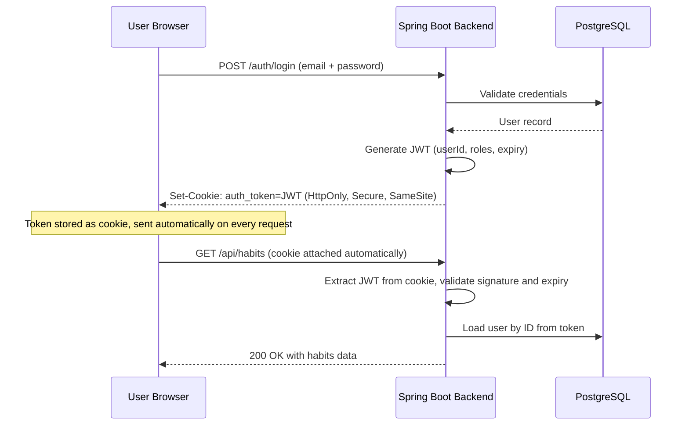
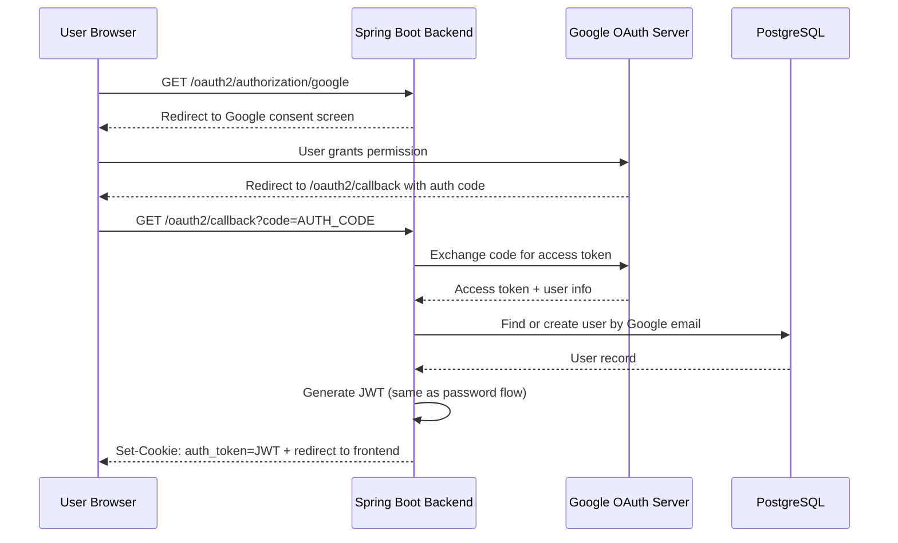

Authentication is one of those features that every app needs but few get right on the first try. In Beyou, we wanted an auth system that felt seamless for users while being secure enough to protect personal productivity data. This post walks through the key decisions we made, the token flow, and how everything fits together in our Spring Boot backend.

## Overview

The Beyou auth system supports two authentication methods: traditional email/password registration and Google OAuth sign-in. Both paths converge into the same JWT-based session model, meaning the rest of the application does not need to care how the user originally authenticated. Tokens are delivered via HTTP-only cookies rather than through response bodies, which is a deliberate security choice we will explore below.

The backend runs on Spring Boot with Spring Security handling the filter chain. We use virtual threads (Project Loom) for request handling, which pairs well with the blocking nature of database calls during token validation.

## The Token Flow

When a user logs in, the backend generates a JWT containing the user ID and role claims. This token has a configurable expiration (currently set to 24 hours). The token is signed with an HMAC-SHA256 key stored as an environment variable, never hardcoded in source.



The important detail here is that the browser handles cookie attachment automatically. The frontend never needs to read the token, store it in localStorage, or add Authorization headers manually. This eliminates an entire class of XSS-based token theft attacks.

## Cookie-Based Delivery

We chose cookies over the common pattern of returning tokens in the JSON response body for several reasons.

First, HttpOnly cookies cannot be accessed by JavaScript. If an attacker manages to inject a script into the page, they cannot steal the auth token. With localStorage-based tokens, a single XSS vulnerability means full account compromise.

Second, cookies are sent automatically by the browser on every request to the same origin. This simplifies the frontend code significantly because there is no need for an axios interceptor that attaches the Authorization header.

Third, we control the cookie attributes server-side. The COOKIE_SECURE environment variable toggles the Secure flag, allowing us to use non-secure cookies in local development (HTTP on localhost) while enforcing HTTPS-only cookies in production.

The cookie configuration looks like this in our auth service:

```java
ResponseCookie cookie = ResponseCookie.from("auth_token", jwt)
    .httpOnly(true)
    .secure(cookieSecure)
    .sameSite("Lax")
    .path("/")
    .maxAge(Duration.ofHours(24))
    .build();
```

The SameSite=Lax setting prevents the cookie from being sent on cross-origin POST requests, which mitigates CSRF attacks while still allowing normal navigation links to work.

## Google OAuth Integration

For Google OAuth, we use Spring Security OAuth2 Client with a custom success handler. When a user clicks "Sign in with Google", the following flow occurs:



The key design decision here is the "find or create" step. If a user with the same email already exists from a password-based registration, we link the Google identity to that existing account rather than creating a duplicate. This prevents the confusing situation where a user has two separate accounts with the same email.

After the OAuth callback, the backend redirects the user to the frontend application with the cookie already set. The frontend detects the authenticated state on its next API call and updates the Redux store accordingly.

## Security Decisions

Several security decisions shaped the final architecture:

**No refresh tokens (yet).** We opted for a single access token with a 24-hour lifetime. This simplifies the implementation significantly. Users who stay active get a smooth experience, and the 24-hour window is short enough to limit damage from a compromised token. We may add refresh token rotation in the future as the user base grows.

**Server-side token validation only.** The frontend never decodes or inspects the JWT. All it knows is whether API calls succeed or return 401. This means we can change the token format, add claims, or switch signing algorithms without touching the frontend.

**Environment-based secret management.** The JWT signing key, Google OAuth client secret, and cookie configuration are all driven by environment variables. The application.yaml file references these variables with sensible defaults for development, but production values are injected at deploy time and never committed to source control.

**Filter chain ordering.** The JWT validation filter sits early in the Spring Security filter chain, before any authorization checks. This ensures that every protected endpoint benefits from the same validation logic without needing per-controller annotations.

## Lessons Learned

Building this system reinforced a few important principles. Keep the token opaque to the client. Let the browser handle token transport when possible. And always design for the case where password-based and OAuth users might share an email address. These patterns have served us well as Beyou has grown, and they provide a solid foundation for future enhancements like multi-factor authentication and session revocation.
