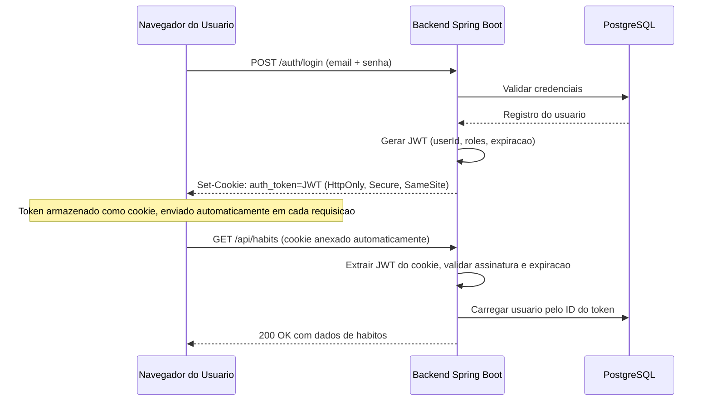
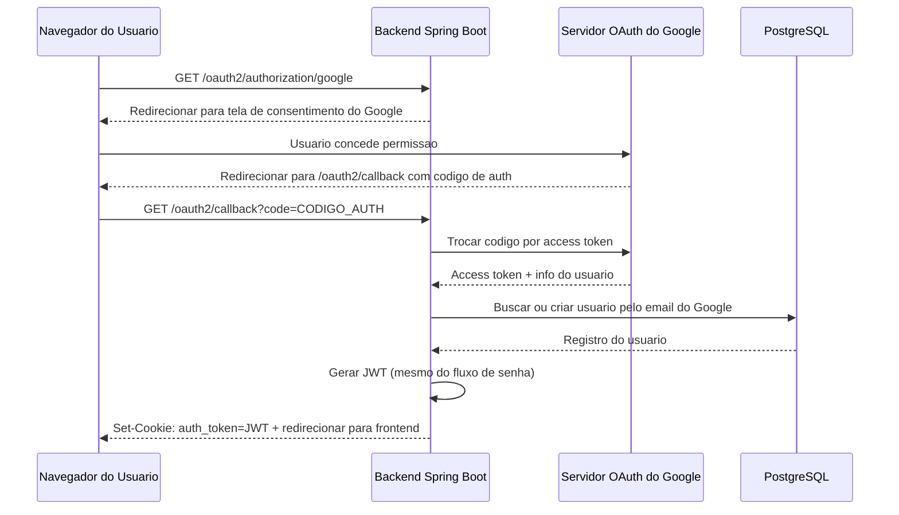

Autenticacao e uma daquelas funcionalidades que todo app precisa, mas poucos acertam de primeira. No Beyou, queriamos um sistema de auth que fosse transparente para os usuarios e ao mesmo tempo seguro o suficiente para proteger dados pessoais de produtividade. Este post percorre as decisoes-chave que tomamos, o fluxo de tokens e como tudo se encaixa no nosso backend Spring Boot.

## Visao Geral

O sistema de auth do Beyou suporta dois metodos de autenticacao: registro tradicional com email/senha e login com Google OAuth. Ambos os caminhos convergem para o mesmo modelo de sessao baseado em JWT, o que significa que o restante da aplicacao nao precisa se preocupar com como o usuario se autenticou originalmente. Os tokens sao entregues via cookies HTTP-only em vez de no corpo da resposta, uma escolha deliberada de seguranca que exploraremos abaixo.

O backend roda em Spring Boot com o Spring Security gerenciando a cadeia de filtros. Usamos virtual threads (Project Loom) para o tratamento de requisicoes, o que combina bem com a natureza bloqueante das chamadas ao banco durante a validacao de tokens.

## O Fluxo de Tokens

Quando um usuario faz login, o backend gera um JWT contendo o ID do usuario e claims de roles. Este token tem uma expiracao configuravel (atualmente definida para 24 horas). O token e assinado com uma chave HMAC-SHA256 armazenada como variavel de ambiente, nunca hardcoded no codigo-fonte.



O detalhe importante aqui e que o navegador lida com o envio do cookie automaticamente. O frontend nunca precisa ler o token, armazena-lo no localStorage ou adicionar headers Authorization manualmente. Isso elimina toda uma classe de ataques de roubo de token baseados em XSS.

## Entrega via Cookies

Escolhemos cookies em vez do padrao comum de retornar tokens no corpo da resposta JSON por varios motivos.

Primeiro, cookies HttpOnly nao podem ser acessados por JavaScript. Se um atacante conseguir injetar um script na pagina, ele nao consegue roubar o token de auth. Com tokens baseados em localStorage, uma unica vulnerabilidade XSS significa comprometimento total da conta.

Segundo, cookies sao enviados automaticamente pelo navegador em toda requisicao para a mesma origem. Isso simplifica o codigo do frontend significativamente porque nao ha necessidade de um interceptor axios que anexe o header Authorization.

Terceiro, controlamos os atributos do cookie no lado do servidor. A variavel de ambiente COOKIE_SECURE alterna a flag Secure, permitindo usar cookies nao-seguros no desenvolvimento local (HTTP no localhost) enquanto impoe cookies HTTPS-only em producao.

A configuracao do cookie fica assim no nosso servico de auth:

```java
ResponseCookie cookie = ResponseCookie.from("auth_token", jwt)
    .httpOnly(true)
    .secure(cookieSecure)
    .sameSite("Lax")
    .path("/")
    .maxAge(Duration.ofHours(24))
    .build();
```

A configuracao SameSite=Lax impede que o cookie seja enviado em requisicoes POST cross-origin, o que mitiga ataques CSRF enquanto ainda permite que links de navegacao normais funcionem.

## Integracao com Google OAuth

Para o Google OAuth, usamos o Spring Security OAuth2 Client com um success handler customizado. Quando um usuario clica em "Entrar com Google", o seguinte fluxo ocorre:



A decisao-chave de design aqui e o passo "buscar ou criar". Se um usuario com o mesmo email ja existe de um registro baseado em senha, vinculamos a identidade Google a essa conta existente em vez de criar uma duplicata. Isso previne a situacao confusa onde um usuario tem duas contas separadas com o mesmo email.

Apos o callback OAuth, o backend redireciona o usuario para a aplicacao frontend com o cookie ja definido. O frontend detecta o estado autenticado na sua proxima chamada API e atualiza o store Redux correspondentemente.

## Decisoes de Seguranca

Varias decisoes de seguranca moldaram a arquitetura final:

**Sem refresh tokens (por enquanto).** Optamos por um unico access token com validade de 24 horas. Isso simplifica a implementacao significativamente. Usuarios que permanecem ativos tem uma experiencia fluida, e a janela de 24 horas e curta o suficiente para limitar danos de um token comprometido. Podemos adicionar rotacao de refresh tokens no futuro conforme a base de usuarios cresça.

**Validacao de token apenas no servidor.** O frontend nunca decodifica ou inspeciona o JWT. Tudo que ele sabe e se as chamadas API retornam sucesso ou 401. Isso significa que podemos mudar o formato do token, adicionar claims ou trocar algoritmos de assinatura sem tocar no frontend.

**Gerenciamento de secrets via ambiente.** A chave de assinatura JWT, o client secret do Google OAuth e a configuracao de cookies sao todos controlados por variaveis de ambiente. O arquivo application.yaml referencia essas variaveis com valores padrao sensiveis para desenvolvimento, mas os valores de producao sao injetados no deploy e nunca commitados no controle de versao.

**Ordenacao da cadeia de filtros.** O filtro de validacao JWT fica no inicio da cadeia de filtros do Spring Security, antes de qualquer verificacao de autorizacao. Isso garante que todo endpoint protegido se beneficie da mesma logica de validacao sem precisar de anotacoes por controller.

## Licoes Aprendidas

Construir este sistema reforcou alguns principios importantes. Mantenha o token opaco para o cliente. Deixe o navegador lidar com o transporte do token quando possivel. E sempre projete para o caso onde usuarios de senha e OAuth possam compartilhar um endereco de email. Esses padroes nos serviram bem conforme o Beyou cresceu, e fornecem uma base solida para melhorias futuras como autenticacao multi-fator e revogacao de sessoes.
