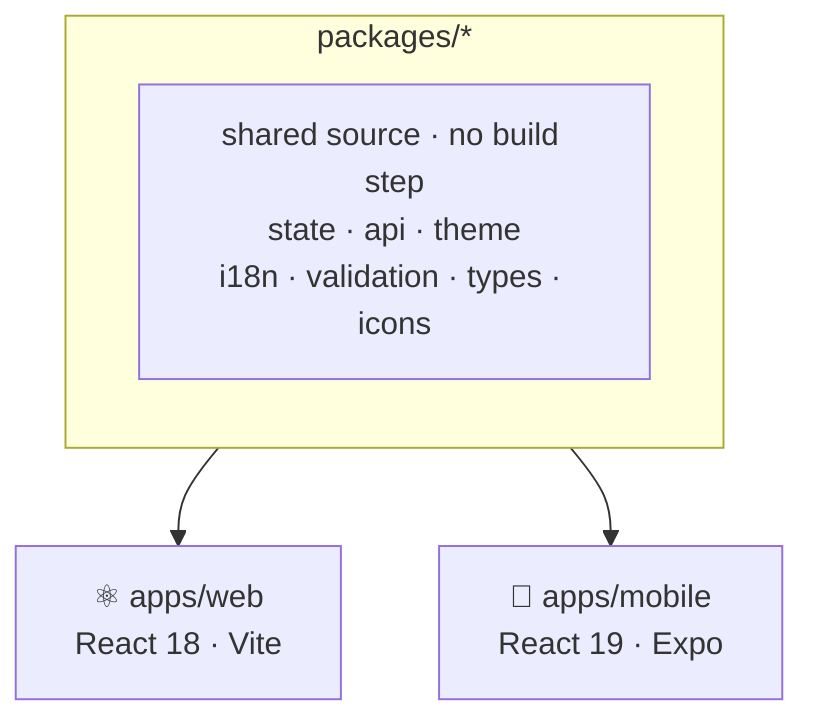

I had just finished self-hosting Beyou. Domain bought, tunnel configured, the whole stack running on my own machine, and the app finally reachable from any browser, anywhere. It felt like crossing a finish line.

And then, using my own product, I figured out something a bit uncomfortable: this kind of app is primarily mobile. A habit tracker lives in the moments between things. You want to check an item right after doing it, look at your goals while waiting in line, see your streak before going to bed. Not only when you happen to be at a computer. The web version being available everywhere just made it more obvious that "everywhere" mostly means my pocket.

So it was time for a native app.

## Flutter was the obvious choice. I researched anyway.

Here's the funny part: I'm taking a technical course in mobile development here in Portugal, and the course teaches Flutter. The natural move was to build Beyou's app in Flutter and practice my studies at the same time. That was genuinely my first thought.

But an app you'll maintain for years deserves more than "it matches my homework." So I did the research properly: I wrote three competing studies, one for each of the main options (React Native + Expo, Flutter, and Kotlin Multiplatform), each written as an advocacy piece arguing its best case.

React Native won, and it won on one architectural observation about my own codebase: Beyou's web frontend already had its business logic cleanly separated from the DOM. The Redux state, the API services, the Zod validation, the domain types, the translations, even the themes, which were plain objects of hex strings rather than CSS files. Thousands of lines of pure TypeScript, portable with almost no rewriting. Flutter would have forced me to rewrite all of it in Dart. React Native let me move it into shared packages and keep it.

The study was also honest about the two real costs, and both predictions came true: the auth would need re-architecting (the web's httpOnly cookie approach doesn't port to native), and every visual component would be a rewrite.

## The monorepo

The plan converted the repo into an npm workspace with Turborepo on top:

The decision that shaped everything: the shared packages have no build step. Their package.json points straight at the TypeScript source, Vite aliases them for the web, and Metro watches them for mobile. Edit a file in `packages/state` with both dev servers running and both apps hot-reload in the same second. There's no publish step, no version bump, no waiting.

Each app plugs into the shared code through deliberately narrow seams. The api package defines an HttpClient interface of exactly four methods; the web registers an axios adapter (cookies, silent refresh), mobile registers a fetch adapter that keeps tokens in the secure store and sends an `X-Client: mobile` header. Same repositories, same error model, two transports. The theme package does the same trick: one token map, applied as CSS variables on the web and as NativeWind variables on the phone.

## The hard parts

**Two Reacts in one tree.** The web app runs React 18. React Native needed React 19. Making both live in a single npm workspace was the roughest patch of the whole migration: version overrides at the root, Metro pinned to the mobile app's own copies, and a resolver that redirects three native libraries to the right place, because a hoisted duplicate of the animation runtime makes every styled component render with no styles at all and no error anywhere.

That period left one commandment written in three separate files of the repo: **never run npm dedupe**. It collapses the two Reacts and breaks both bundlers. Someday I'll upgrade the web app to React 19 and retire the whole arrangement, but that's a project for another day.

**Looking like Beyou without copying Beyou.** The other challenge had nothing to do with tooling. I wanted the mobile app to feel like the same product, with the same colors, the same personality, the same gamification language, without chasing pixel-perfect parity with the web layouts. A native app has its own conventions: bottom navigation instead of a sidebar, sheets instead of dropdowns, screens instead of panels. The shared theme tokens carry the identity; the components respect the platform. Getting that balance right took more design judgment than code.

## The payoff

The moment the architecture proved itself was less dramatic and more constant than I expected: everything I built for mobile showed up in the web app too. Progress in one was progress in both.

The gamification logic is the clearest example. The function that applies a check-in response (XP totals, level-up detection, streak milestone celebrations) lives in the shared state package. When I built it for the mobile dashboard, the web dashboard got the same behavior from the same file. A bug fixed there is fixed everywhere. The list of streak milestones, the widget ids, the sorting logic, the date helpers: written once, running on both.

And the monorepo keeps paying in CI: the Android build workflow triggers on changes to the mobile app or any shared package, so a change in the state package automatically produces a fresh APK.

## Where it is now

The mobile app covers the core of Beyou: the dashboard with check-ins and celebrations, habits with the icon picker, routines with the builder and schedules, the onboarding tutorial, and the AI assistant. Every merge builds a signed APK published to a rolling GitHub release. No app store yet; the download link is enough for this stage.

Regrets, so far: none. Ask me again after the React 19 upgrade.
