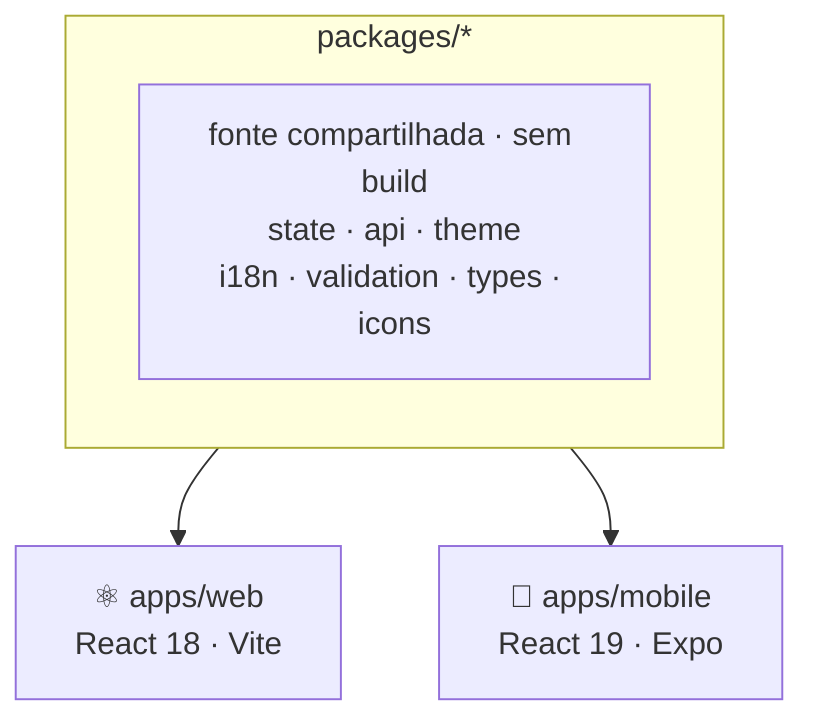

Eu tinha acabado de terminar o self-host do Beyou. Domínio comprado, túnel configurado, a stack inteira rodando na minha própria máquina, e o app finalmente acessível de qualquer navegador, em qualquer lugar. Parecia uma linha de chegada.

E então, usando meu próprio produto, percebi algo meio desconfortável: esse tipo de app é primariamente mobile. Um rastreador de hábitos vive nos momentos entre as coisas. Você quer marcar um item logo depois de fazê-lo, olhar suas metas esperando numa fila, ver seu streak antes de dormir. Não só quando por acaso está num computador. A versão web estar disponível em todo lugar só deixou mais óbvio que "todo lugar" significa, na maior parte do tempo, o meu bolso.

Então era hora de um app nativo.

## Flutter era a escolha óbvia. Pesquisei mesmo assim.

A parte engraçada: estou fazendo um curso técnico de desenvolvimento mobile aqui em Portugal, e o curso ensina Flutter. O movimento natural era construir o app do Beyou em Flutter e praticar os estudos ao mesmo tempo. Esse foi genuinamente meu primeiro pensamento.

Mas um app que você vai manter por anos merece mais do que "combina com meu dever de casa." Então fiz a pesquisa direito: escrevi três estudos concorrentes, um para cada opção principal (React Native + Expo, Flutter e Kotlin Multiplatform), cada um escrito como uma peça de defesa argumentando seu melhor caso.

O React Native venceu, e venceu por uma observação arquitetural sobre o meu próprio código: o frontend web do Beyou já tinha a lógica de negócio separada do DOM de forma limpa. O estado Redux, os serviços de API, a validação Zod, os tipos de domínio, as traduções, até os temas, que eram objetos simples de strings hex em vez de arquivos CSS. Milhares de linhas de TypeScript puro, portáveis quase sem reescrita. O Flutter me obrigaria a reescrever tudo isso em Dart. O React Native me deixou mover tudo para pacotes compartilhados e manter.

O estudo também foi honesto sobre os dois custos reais, e as duas previsões se cumpriram: a autenticação precisaria de rearquitetura (o esquema de cookie httpOnly do web não porta para o nativo), e cada componente visual seria uma reescrita.

## O monorepo

O plano converteu o repositório em um npm workspace com Turborepo por cima:

A decisão que moldou tudo: os pacotes compartilhados não têm etapa de build. O package.json deles aponta direto para o código TypeScript, o Vite os apelida para o web, e o Metro os observa para o mobile. Edite um arquivo em `packages/state` com os dois servidores de dev rodando e os dois apps recarregam no mesmo segundo. Não existe passo de publicação, nem bump de versão, nem espera.

Cada app se conecta ao código compartilhado por costuras deliberadamente estreitas. O pacote de api define uma interface HttpClient de exatamente quatro métodos; o web registra um adaptador axios (cookies, refresh silencioso), o mobile registra um adaptador fetch que guarda tokens no secure store e envia um header `X-Client: mobile`. Mesmos repositórios, mesmo modelo de erro, dois transportes. O pacote de tema faz o mesmo truque: um mapa de tokens, aplicado como variáveis CSS no web e como variáveis NativeWind no celular.

## As partes difíceis

**Dois Reacts em uma árvore.** O web app roda React 18. O React Native precisava do React 19. Fazer os dois viverem em um único workspace npm foi o trecho mais áspero da migração inteira: overrides de versão na raiz, o Metro fixado nas cópias do próprio app mobile, e um resolvedor que redireciona três bibliotecas nativas para o lugar certo, porque uma duplicata içada do runtime de animação faz cada componente estilizado renderizar sem estilo nenhum e sem erro em lugar nenhum.

Esse período deixou um mandamento escrito em três arquivos separados do repositório: **nunca rode npm dedupe**. Ele colapsa os dois Reacts e quebra os dois bundlers. Um dia vou atualizar o web app para o React 19 e aposentar o arranjo inteiro, mas isso é projeto para outro dia.

**Parecer o Beyou sem copiar o Beyou.** O outro desafio não tinha nada a ver com ferramentas. Eu queria que o app mobile parecesse o mesmo produto, com as mesmas cores, a mesma personalidade, a mesma linguagem de gamificação, sem perseguir paridade pixel-perfect com os layouts do web. Um app nativo tem convenções próprias: navegação embaixo em vez de sidebar, sheets em vez de dropdowns, telas em vez de painéis. Os tokens de tema compartilhados carregam a identidade; os componentes respeitam a plataforma. Acertar esse equilíbrio pediu mais julgamento de design do que código.

## A recompensa

O momento em que a arquitetura se provou foi menos dramático e mais constante do que eu esperava: tudo que eu construía para o mobile aparecia no web app também. Progresso em um era progresso nos dois.

A lógica de gamificação é o exemplo mais claro. A função que aplica a resposta de um check-in (totais de XP, detecção de level-up, celebrações de marcos de streak) vive no pacote de estado compartilhado. Quando a construí para o dashboard mobile, o dashboard web ganhou o mesmo comportamento do mesmo arquivo. Um bug corrigido lá está corrigido em todo lugar. A lista de marcos de streak, os ids dos widgets, a lógica de ordenação, os helpers de data: escritos uma vez, rodando nos dois.

E o monorepo continua pagando no CI: o workflow de build do Android dispara em mudanças no app mobile ou em qualquer pacote compartilhado, então uma mudança no pacote de estado produz automaticamente um APK fresco.

## Onde está agora

O app mobile cobre o núcleo do Beyou: o dashboard com check-ins e celebrações, hábitos com o seletor de ícones, rotinas com o builder e os agendamentos, o tutorial de onboarding e o assistente de IA. Cada merge constrói um APK assinado publicado em um release rolante do GitHub. Sem loja de aplicativos ainda; o link de download basta para esta fase.

Arrependimentos, até agora: nenhum. Me pergunte de novo depois do upgrade para o React 19.
