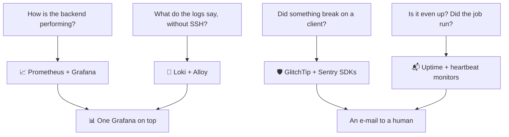

I'll admit the bias upfront: watching how software behaves is one of the parts of engineering I enjoy the most. How much CPU is it using? What is the memory doing? Is some mysterious error happening in a user's browser right now, invisible to me? I would never deploy an app where I can't answer those questions.

So before Beyou faced production, while it still had essentially no users, I researched the practices and built the monitoring properly. Not one tool: layers, each answering a question the previous one couldn't. This post walks through them in the order they arrived.

## Layer 1: the classic pair

Prometheus and Grafana came first, because the first question was about the backend: how is it behaving? The Spring Boot actuator exposes Micrometer metrics, Prometheus scrapes them every 15 seconds, and Grafana turns them into the service health dashboard: JVM memory and GC, HTTP latency percentiles per endpoint, the Hikari connection pool, cache hit rates, repository timings.

Around the backend I added exporters, so the same board answers for the machine itself: cAdvisor for per-container resources, node-exporter for the host, postgres-exporter so the database reports from its own side of the connection.

One decision I'd defend anywhere: the big dashboards are generated by Python scripts committed next to the JSON. Panel layout is code, not click history. When I want a new panel, I edit the generator and regenerate, and the dashboard can never drift into something nobody can reproduce.

## Layer 2: the errors I cannot see

Then came the thought that pushed everything further: I'm about to deploy, and if an error happens in the frontend, in someone else's browser, how would I ever know? Backend errors at least land in my logs. A client-side crash just... happens, somewhere, to someone.

That question led me to Sentry's SDK ecosystem and then to GlitchTip, its self-hostable, API-compatible cousin. Today the backend, the web app, and the mobile app all deliver errors to my own GlitchTip, split into separate projects so each surface groups and alerts independently, plus a fourth DSN-less project just for infrastructure monitors.

This was, by a wide margin, the hardest layer. The others were mostly configuration; this one was real integration work. Each platform needed its proper SDK installed and tuned to report only what deserves attention: uncaught exceptions, not ordinary business errors. That meant filtering out the backend's expected domain failures, teaching the web app to report render crashes from the error boundary (which stops propagation, so automatic capture never sees them) and API failures from a client that never throws, uploading source maps so minified stack traces resolve, and scrubbing tokens out of reported URLs. A collector also has one requirement the rest of the stack doesn't: it must be reachable from real browsers and real phones, so it's the one monitoring surface exposed publicly.

## Layer 3: logs without SSH

The remaining annoyance: every time I wanted to read logs, it meant SSH into the server and digging through docker logs. So Loki joined, with Alloy feeding it.

The setup I landed on requires zero configuration from the apps: Alloy watches the Docker API, keeps every container belonging to the Beyou stack, and ships whatever they print to Loki, which detects log levels server-side. Thirty days of history, queryable from the same Grafana as the metrics. When something looks wrong on a graph, the logs explaining it are one tab away, and my SSH sessions are for actual administration now, not for reading.

## Layer 4: knowing it's up, and that the robot did its job

Metrics, errors, and logs all assume something is running. The last layer covers the cases where the answer is no. GlitchTip probes a dozen targets from inside the network (the backend's health endpoint, the frontend, both databases, every monitoring service) and emails me on a state change.

My favorite piece is the heartbeat monitor, because the check is inverted. Beyou has an hourly scheduler that snapshots routines, and a wedged scheduler is invisible: the health endpoint stays green while snapshots silently stop. So the scheduler checks in with GlitchTip after each completed cycle, and the alert fires when the check-ins stop coming. It alerts on the absence of success instead of the presence of failure.

## The daily habit

I actually use all of it. For a long time my ritual was opening the backend service-health dashboard. Now there are more of them, and my attention has shifted: the AI agent dashboard shows usage per model, which provider in the fallback chain is actually serving, token consumption, and tool calls; the containers dashboard shows the whole fleet of my infrastructure at a glance. Watching real usage move through graphs I built is, honestly, half the reward of self-hosting.

## Why self-host all of it

Cost, for sure. Datadog or hosted Sentry for a free app makes no sense, and this whole stack runs on the same machine as Beyou for zero dollars, with retention aligned at 30 days across logs and errors.

But it isn't only cost. Learning and configuring my own stuff always gets me. Every layer here taught me something a managed dashboard would have hidden: how scrape targets work, what a log label costs, why a collector must strip tokens from URLs, what a heartbeat monitor is actually for. The monitoring stack ended up being one of the best courses I've taken, and I wrote it in Compose files.

One last detail that makes it all sustainable: the entire observability stack is a single Compose overlay, and the same file runs in development and production. What I debug locally is exactly what watches over production. No surprises between environments, which is the whole point of watching in the first place.
