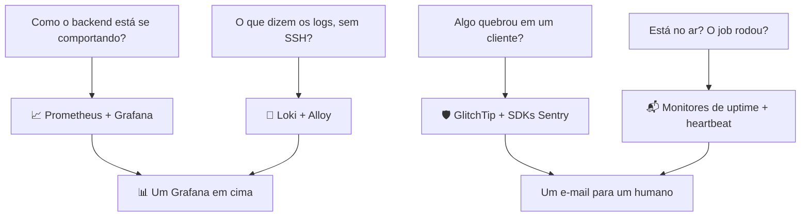

Admito o viés de cara: observar como o software se comporta é uma das partes da engenharia que eu mais gosto. Quanto de CPU está usando? O que a memória está fazendo? Algum erro misterioso está acontecendo agora no navegador de um usuário, invisível para mim? Eu nunca faria deploy de um app onde não consigo responder essas perguntas.

Então, antes de o Beyou encarar produção, quando ele ainda não tinha praticamente nenhum usuário, pesquisei as práticas e construí o monitoramento direito. Não uma ferramenta: camadas, cada uma respondendo uma pergunta que a anterior não conseguia. Este post as percorre na ordem em que chegaram.

## Camada 1: a dupla clássica

Prometheus e Grafana vieram primeiro, porque a primeira pergunta era sobre o backend: como ele está se comportando? O actuator do Spring Boot expõe métricas Micrometer, o Prometheus as coleta a cada 15 segundos, e o Grafana as transforma no dashboard de saúde do serviço: memória e GC da JVM, percentis de latência HTTP por endpoint, o pool de conexões Hikari, taxas de acerto de cache, tempos dos repositórios.

Ao redor do backend adicionei exporters, para o mesmo painel responder pela máquina: cAdvisor para recursos por container, node-exporter para o host, postgres-exporter para o banco reportar do lado dele da conexão.

Uma decisão que eu defenderia em qualquer lugar: os dashboards grandes são gerados por scripts Python commitados junto do JSON. O layout dos painéis é código, não histórico de cliques. Quando quero um painel novo, edito o gerador e regenero, e o dashboard nunca deriva para algo que ninguém consegue reproduzir.

## Camada 2: os erros que eu não consigo ver

Então veio o pensamento que empurrou tudo adiante: estou prestes a fazer o deploy, e se um erro acontecer no frontend, no navegador de outra pessoa, como é que eu vou saber? Erros do backend pelo menos caem nos meus logs. Uma quebra no lado do cliente simplesmente... acontece, em algum lugar, com alguém.

Essa pergunta me levou ao ecossistema de SDKs do Sentry e então ao GlitchTip, o primo self-hosted e compatível com a mesma API. Hoje o backend, o web app e o app mobile entregam erros ao meu próprio GlitchTip, separados em projetos para cada superfície agrupar e alertar de forma independente, mais um quarto projeto sem DSN só para os monitores de infraestrutura.

Essa foi, de longe, a camada mais difícil. As outras eram majoritariamente configuração; essa foi trabalho real de integração. Cada plataforma precisou do SDK adequado instalado e ajustado para reportar só o que merece atenção: exceções não capturadas, não erros comuns de negócio. Isso significou filtrar as falhas de domínio esperadas do backend, ensinar o web app a reportar quebras de renderização a partir do error boundary (que para a propagação, então a captura automática nunca as vê) e falhas de API de um cliente que nunca lança exceção, subir source maps para os stack traces minificados resolverem, e limpar tokens das URLs reportadas. Um coletor também tem um requisito que o resto da stack não tem: precisa ser alcançável por navegadores e celulares reais, então é a única superfície de monitoramento exposta publicamente.

## Camada 3: logs sem SSH

O incômodo restante: toda vez que eu queria ler logs, era SSH no servidor e escavação em docker logs. Então o Loki entrou, com o Alloy o alimentando.

A montagem em que aterrissei exige zero configuração dos apps: o Alloy observa a API do Docker, mantém cada container que pertence à stack do Beyou e despacha o que eles imprimem para o Loki, que detecta os níveis de log no servidor. Trinta dias de histórico, consultáveis no mesmo Grafana das métricas. Quando algo parece errado em um gráfico, os logs que explicam estão a uma aba de distância, e minhas sessões de SSH agora são para administração de verdade, não para leitura.

## Camada 4: saber que está no ar, e que o robô fez o trabalho dele

Métricas, erros e logs assumem que algo está rodando. A última camada cobre os casos em que a resposta é não. O GlitchTip sonda uma dúzia de alvos de dentro da rede (o endpoint de saúde do backend, o frontend, os dois bancos, cada serviço de monitoramento) e me manda e-mail a cada mudança de estado.

Minha peça favorita é o monitor de heartbeat, porque a checagem é invertida. O Beyou tem um scheduler de hora em hora que tira snapshots das rotinas, e um scheduler travado é invisível: o endpoint de saúde continua verde enquanto os snapshots param em silêncio. Então o scheduler se reporta ao GlitchTip depois de cada ciclo completo, e o alerta dispara quando os reportes param de chegar. Ele alerta na ausência de sucesso em vez de na presença de falha.

## O hábito diário

Eu realmente uso tudo isso. Por muito tempo meu ritual era abrir o dashboard de saúde do backend. Agora existem vários, e minha atenção mudou: o dashboard do agente de IA mostra o uso por modelo, qual provedor da cadeia de fallback está de fato servindo, o consumo de tokens e as chamadas de ferramentas; o dashboard de containers mostra a frota inteira da minha infra de uma olhada. Ver uso real se movendo em gráficos que eu construí é, honestamente, metade da recompensa do self-host.

## Por que self-hostear tudo isso

Custo, com certeza. Datadog ou Sentry gerenciado para um app gratuito não faz sentido, e essa stack inteira roda na mesma máquina do Beyou por zero dólares, com retenção alinhada em 30 dias entre logs e erros.

Mas não é só custo. Aprender e configurar minhas próprias coisas sempre me pega. Cada camada aqui me ensinou algo que um dashboard gerenciado teria escondido: como funcionam alvos de coleta, quanto custa um label de log, por que um coletor precisa limpar tokens de URLs, para que serve de verdade um monitor de heartbeat. A stack de monitoramento acabou sendo um dos melhores cursos que já fiz, e eu a escrevi em arquivos Compose.

Um último detalhe que torna tudo sustentável: a stack inteira de observabilidade é um único overlay do Compose, e o mesmo arquivo roda em desenvolvimento e produção. O que eu depuro localmente é exatamente o que vigia a produção. Sem surpresas entre ambientes, que é o sentido de vigiar, para começo de conversa.
