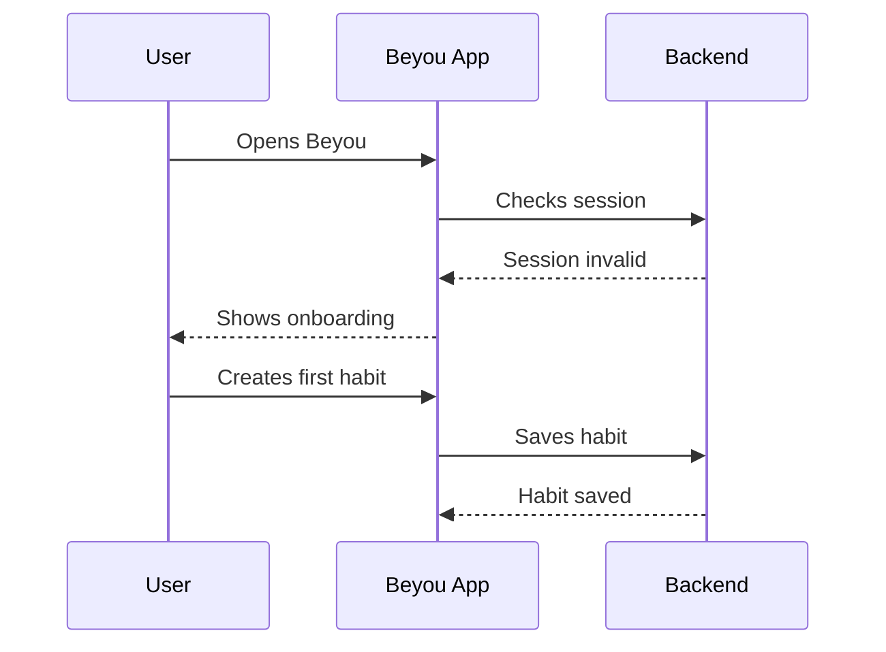
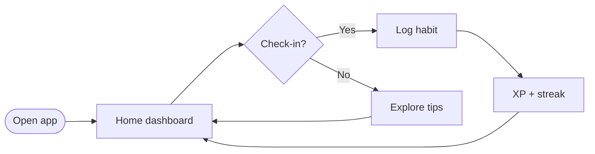

The design below shows the full experience for a new user, mixing narrative and diagrams.

## Onboarding sequence

## Daily flow

## Notes

- Keep the check-in call-to-action visible after onboarding.
- Reward feedback should be immediate to reinforce the habit loop.
