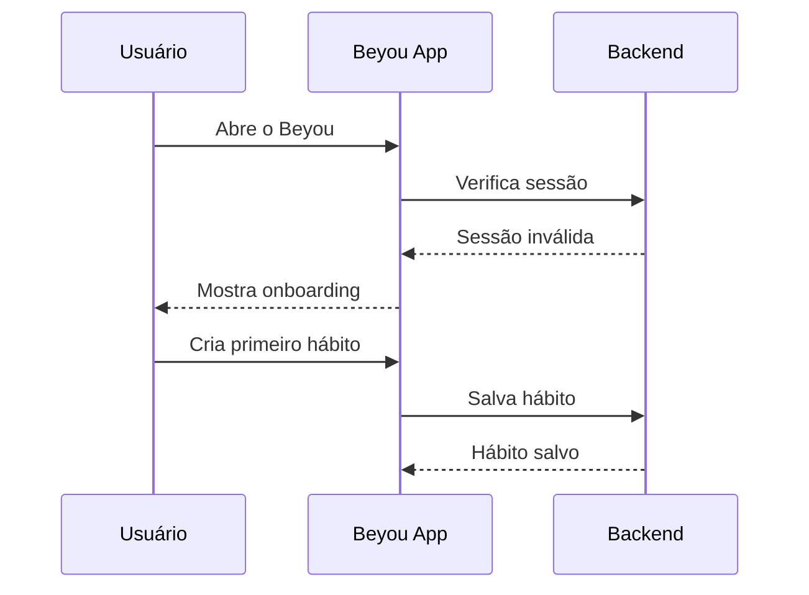
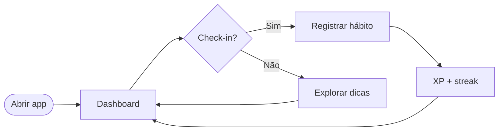

O design abaixo mostra a experiência completa para um novo usuário, combinando narrativa e diagramas.

## Sequência de onboarding

## Fluxo diário

## Observações

- Mantenha o CTA de check-in visível após o onboarding.
- O feedback de recompensa deve ser imediato para reforçar o loop de hábito.
