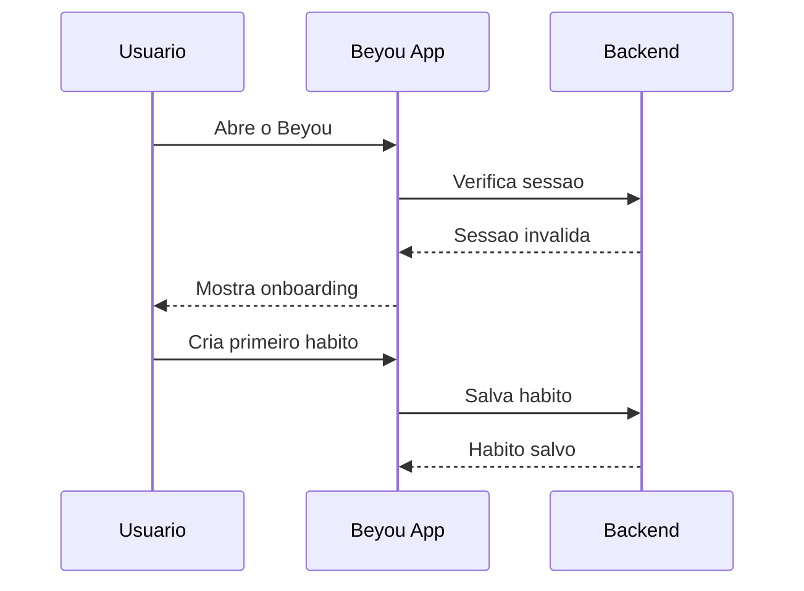

O design abaixo mostra a experiencia completa para um novo usuario, combinando narrativa e diagramas.

## Sequencia de onboarding

## Fluxo diario

## Observacoes

- Mantenha o CTA de check-in visivel apos o onboarding.
- O feedback de recompensa deve ser imediato para reforcar o loop de habito.
